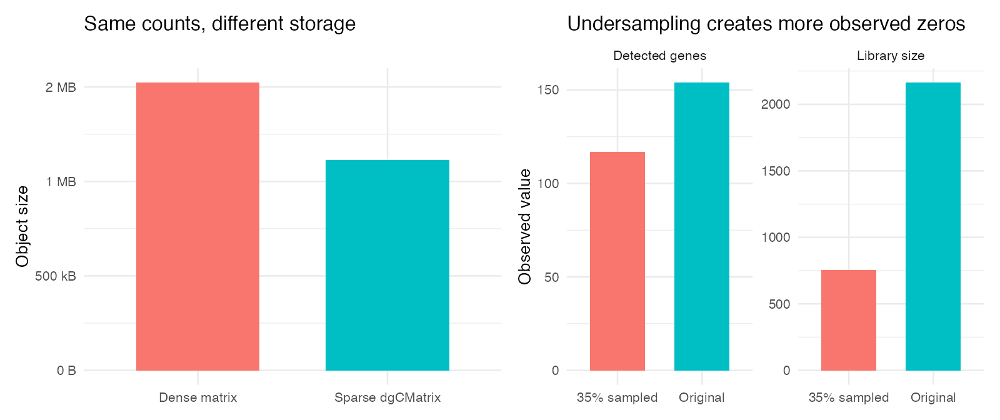
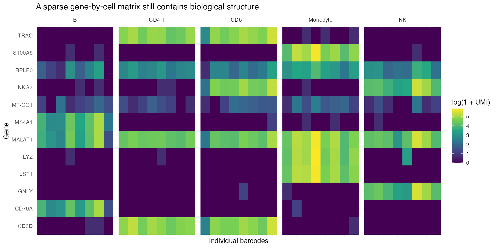

## Learning objectives

By the end of this module, you should be able to:

1. distinguish a read, UMI, barcode, gene, droplet, and putative cell;
2. explain how those entities become a gene-by-cell count matrix;
3. inspect sparse matrices without unnecessarily converting them to dense matrices;
4. calculate library size, detected features, and sparsity manually;
5. explain why an observed zero does not reveal whether expression was biologically absent;
6. predict what undersampling does to counts and detected genes; and
7. identify signatures consistent with empty droplets, ambient RNA, and doublets.

**Suggested time:** 60–90 minutes of conceptual work plus 90 minutes of computation.

## Begin with the measurement process

A count matrix is not a direct inventory of every RNA molecule that existed in each cell. It is the endpoint of a lossy measurement process:

```text
tissue or cell suspension
        ↓
cells partitioned into droplets or wells
        ↓
captured molecules receive cell barcodes and UMIs
        ↓
cDNA amplification and sequencing produce reads
        ↓
reads are assigned to genes, barcodes, and UMIs
        ↓
duplicate reads from the same captured molecule are collapsed
        ↓
gene × barcode UMI count matrix
```

At every arrow, information can be lost or distorted. Some molecules are never captured, some droplets contain no cell, some contain multiple cells, and free RNA can enter droplets from the surrounding solution.

### Terms that must not be conflated

| Term | Operational meaning | What it does **not** guarantee |
|---|---|---|
| Droplet | A physical partition created by a droplet-based platform | That exactly one intact cell was captured |
| Barcode | A sequence intended to identify the partition of origin | That the barcode represents a viable singlet cell |
| Read | A sequenced fragment produced from amplified cDNA | A distinct original RNA molecule |
| UMI | A molecular tag used to collapse reads likely derived from one captured molecule | Perfect one-to-one recovery of molecules present in the cell |
| Gene count | Number of observed UMIs assigned to a gene and barcode | Absolute transcript abundance in the original cell |
| Library size | Sum of observed UMI counts for one barcode | Cell size, total RNA content, or sequencing depth alone |

Repeated sequencing reads carrying the same gene, cell barcode, and UMI are usually treated as evidence for one captured molecule. Therefore, **read count** and **UMI count** answer different questions.

::: {.callout-warning title="A common language error"}
Saying “the cell has 40 transcripts of CD3D” overstates the measurement. A raw value of 40 means that 40 CD3D UMIs were observed and retained after processing under the assay's counting rules.
:::

## Matrix anatomy

This course stores raw counts as **genes in rows and barcodes in columns**, the orientation expected by `CreateSeuratObject()`:

```text
             Cell_A   Cell_B   Cell_C
CD3D             20       40        0
NKG7              10       20       50
MS4A1              0        0        0
LST1                0        0       10
```

Other software may present cells in rows and genes in columns. Always inspect row and column names before calculating summaries. A transposed matrix can produce plausible-looking but meaningless results.

### Load the controlled matrix

```r
library(Matrix)

counts <- readRDS("data/synthetic_qc_counts.rds")

class(counts)
dim(counts)
counts[1:8, 1:6]
```

Expected structure:

- 260 gene rows;
- 700 barcode columns; and
- a `dgCMatrix`, which is a compressed sparse column matrix.

The 700 barcodes deliberately include cells, simulated doublets, and empty droplets. A column in a count matrix is therefore a **barcode candidate**, not automatically a validated cell.

## Why sparse matrices matter

Most gene-by-cell entries are zero. A dense matrix allocates memory to every entry. A sparse matrix stores the nonzero values and their positions.

For $G$ genes and $C$ barcodes, define the observed sparsity as:

$$
\operatorname{sparsity}
= 1 - \frac{N_{\mathrm{nonzero}}}{G \times C}.
$$

Calculate it without converting the matrix to dense form:

```r
nonzero_entries <- length(counts@x)
total_entries <- nrow(counts) * ncol(counts)
sparsity <- 1 - nonzero_entries / total_entries

c(
  nonzero_entries = nonzero_entries,
  total_entries = total_entries,
  sparsity = sparsity
)
```

Compare storage for the same values:

```r
sparse_bytes <- object.size(counts)
dense_bytes <- object.size(as.matrix(counts))

c(
  sparse = sparse_bytes,
  dense = dense_bytes,
  dense_over_sparse = as.numeric(dense_bytes) / as.numeric(sparse_bytes)
)
```

Converting this small matrix is safe for teaching. Converting a real matrix containing tens of thousands of genes and hundreds of thousands of cells can exhaust memory.

{fig-alt="Sparse versus dense matrix storage and original versus undersampled library metrics"}

## Inspect one cell and one gene

A **cell-oriented** question examines one column:

```r
cell_id <- "BC0001-1"
cell_counts <- counts[, cell_id, drop = FALSE]

sum(cell_counts)
sum(cell_counts > 0)
named_cell_counts <- setNames(as.numeric(cell_counts), rownames(cell_counts))
sort(named_cell_counts, decreasing = TRUE)[1:10]
```

A **gene-oriented** question examines one row:

```r
gene_counts <- counts["NKG7", ]

summary(as.numeric(gene_counts))
sum(gene_counts > 0)
mean(gene_counts > 0)
```

The first asks what was observed in one barcode. The second asks how a gene is distributed across barcodes. These are different conditional views of the same matrix.

{fig-alt="Heatmap of selected raw UMI counts across controlled immune cell types"}

## Derive Seurat QC fields manually

For barcode $c$, library size is:

$$
L_c = \sum_g x_{g,c},
$$

where $x_{g,c}$ is the observed UMI count for gene $g$ in barcode $c$.

The number of detected features is:

$$
F_c = \sum_g \mathbf{1}(x_{g,c} > 0).
$$

Here, $\mathbf{1}(\cdot)$ equals 1 when the condition is true and 0 otherwise.

```r
manual_library_size <- Matrix::colSums(counts)
manual_detected_features <- Matrix::colSums(counts > 0)

summary(manual_library_size)
summary(manual_detected_features)
```

Confirm that Seurat stores the same calculations:

```r
library(Seurat)

metadata <- read.csv(
  "data/synthetic_qc_metadata.csv",
  na.strings = ""
)
rownames(metadata) <- metadata$cell_id

obj <- CreateSeuratObject(
  counts = counts,
  meta.data = metadata,
  min.cells = 0,
  min.features = 0
)

stopifnot(all(manual_library_size == obj$nCount_RNA))
stopifnot(all(manual_detected_features == obj$nFeature_RNA))
```

The `RNA` suffix identifies the assay. These fields are summaries of the observed matrix—not independent measurements produced by Seurat.

## Controlled depth comparison

Load the four-cell matrix:

```r
toy <- read.csv(
  "data/toy_counts.csv",
  row.names = 1,
  check.names = FALSE
)
toy <- as.matrix(toy)

toy
colSums(toy)
colSums(toy > 0)
```

Cell B has exactly twice the raw counts of Cell A for every detected gene. Their relative expression compositions are identical, but their observed library sizes differ twofold.

```r
toy_proportions <- sweep(toy, 2, colSums(toy), "/")

cbind(
  Cell_A = toy_proportions[, "Cell_A"],
  Cell_B = toy_proportions[, "Cell_B"]
)
```

### Interpret before moving on

1. Which measurement changes between Cell A and Cell B: raw UMI count, gene proportion, or both?
2. Does the twofold difference prove that Cell B biologically contained twice as much RNA?
3. What technical and biological mechanisms could produce the observed difference?

## Why zeros occur

An observed zero can arise through several mechanisms:

### Biological zero

The gene may not have been transcribed in that cell at the relevant time. For example, a B-cell marker such as `MS4A1` may be biologically absent from a T cell.

### Sampling zero

The gene may have been expressed, but no molecule was captured, amplified, sequenced, or retained. Low abundance and limited library size make this more likely.

### Technical or structural absence

Reads may fail alignment, a transcript may be poorly captured by the assay chemistry, or a gene may have been excluded during feature definition.

::: {.callout-important}
One observed zero usually does not identify its mechanism. “Dropout” is a description of incomplete observation, not a label that can be assigned confidently to each zero.
:::

## Perturbation exercise: simulate undersampling

Select one high-quality barcode and retain each observed UMI with probability 0.35. This is a binomial thinning experiment:

$$
x'_{g,c} \sim \operatorname{Binomial}(x_{g,c}, 0.35).
$$

```r
library(ggplot2)
library(patchwork)

set.seed(20260904)

metadata <- obj[[]]
candidate <- which(
  metadata$truth_qc_class == "high_quality" &
    metadata$nCount_RNA > median(metadata$nCount_RNA)
)[1]

original <- as.integer(counts[, candidate])
undersampled <- rbinom(
  length(original),
  size = original,
  prob = 0.35
)

comparison <- data.frame(
  representation = c("Original", "35% sampled"),
  library_size = c(sum(original), sum(undersampled)),
  detected_genes = c(sum(original > 0), sum(undersampled > 0))
)

library_plot <- ggplot(
  comparison,
  aes(representation, library_size, fill = representation)
) +
  geom_col(show.legend = FALSE) +
  labs(x = NULL, y = "Observed UMIs") +
  ggtitle("Library size")

feature_plot <- ggplot(
  comparison,
  aes(representation, detected_genes, fill = representation)
) +
  geom_col(show.legend = FALSE) +
  labs(x = NULL, y = "Genes with count > 0") +
  ggtitle("Detected features")

library_plot + feature_plot
```

### Change one thing

Repeat with retention probabilities `0.8`, `0.5`, `0.2`, and `0.1`. Hold the original cell fixed.

```r
probabilities <- c(0.8, 0.5, 0.2, 0.1)

sampling_results <- lapply(
  probabilities,
  function(probability) {
    thinned <- rbinom(
      length(original),
      size = original,
      prob = probability
    )

    data.frame(
      probability = probability,
      library_size = sum(thinned),
      detected_genes = sum(thinned > 0),
      newly_zero = sum(original > 0 & thinned == 0)
    )
  }
)

do.call(rbind, sampling_results)
```

### What changed? What did not change?

- The source cell and its original biological state did not change.
- The observed library size, detected genes, and number of zeros changed.
- Rare genes are more likely than abundant genes to disappear under thinning.
- A downstream analyst seeing only the thinned matrix cannot recover which zeros were sampling zeros with certainty.

## Ambient RNA, empty droplets, and doublets

### Ambient RNA

When cells lyse, RNA can enter the suspension. An otherwise empty droplet—or a droplet containing a different cell type—can acquire counts from abundant ambient transcripts. A low-level `LYZ` count in a T-cell barcode does not automatically prove myeloid identity.

```r
ambient_genes <- c("LYZ", "HBB", "HBA1", "HBA2", "ALB")
ambient_signal <- Matrix::colSums(counts[ambient_genes, , drop = FALSE])

aggregate(
  ambient_signal,
  by = list(qc_class = obj$truth_qc_class),
  FUN = median
)
```

### Empty droplets

Empty droplets generally have small libraries dominated by the ambient pool. Barcode-calling methods evaluate the count distribution and expression profile rather than assuming every observed barcode is a cell.

```r
table(obj$truth_qc_class)

aggregate(
  cbind(obj$nCount_RNA, obj$nFeature_RNA),
  by = list(qc_class = obj$truth_qc_class),
  FUN = median
)
```

### Doublets

A doublet contains two captured cells under one barcode. It may show unusually high library size and feature count or incompatible marker programs. However, high counts alone do not prove a doublet, and same-lineage doublets can be subtle.

```r
markers <- c("CD3D", "MS4A1", "NKG7", "LST1")
marker_counts <- as.matrix(counts[markers, ])

doublet_examples <- Cells(obj)[obj$truth_qc_class == "doublet"][1:6]
marker_counts[, doublet_examples, drop = FALSE]
```

## Four expression scales

| Quantity | Example | Interpretation |
|---|---|---|
| Read count | 120 reads | Sequenced fragments; PCR duplicates may be present |
| UMI count | 40 UMIs | Observed molecule tags after collapsing reads |
| Normalized expression | `NormalizeData()` output | A library-size-adjusted, transformed value relative to a chosen scale factor |
| Scaled expression | `ScaleData()` output | A gene-centered, variance-scaled value relative to that gene's distribution |

Normalization and scaling are not alternative words for the same operation. Module 3 develops normalization; scaling is intentionally not introduced as a transformation in this release.

## Biological consequence

Suppose two samples contain the same T-cell state but differ in capture efficiency. The lower-depth sample will show more zeros, smaller libraries, and fewer detected features. If those observations are interpreted as weaker biology without considering measurement depth, the analyst can invent a false condition effect.

Conversely, treating every low-count barcode as technical failure can remove genuinely small or low-RNA populations. The matrix does not make this decision for you.

## Common mistakes and limitations

- Treating every barcode as a cell.
- Treating UMI counts as absolute molecule counts.
- Converting a large sparse matrix to dense form for convenience.
- Assuming every zero means “gene off” or every zero means “dropout.”
- Comparing raw counts between cells without considering library size.
- Interpreting high library size as proof of a doublet.
- Calling a cell type from one low ambient-prone marker.
- Forgetting that the matrix orientation can differ across tools.

## Check your understanding

1. A gene has 12 reads but 3 distinct UMIs in one barcode. Which value typically enters the UMI count matrix, and why?
2. Does a matrix column necessarily represent one viable cell?
3. Write the formulas for library size and detected features in words.
4. Why does undersampling increase the number of observed zeros?
5. Can you determine from one zero whether the gene was biologically absent?
6. Why can a doublet escape a simple high-count threshold?
7. Which operation changes the scientific values: converting a sparse matrix to dense form, or binomially thinning the counts?
8. Distinguish raw UMI count, normalized expression, and scaled expression in one sentence each.

## Lab

Run [the Module 1 student lab](../../labs/01-count-matrix-lab.R), then submit a short interpretation in which every figure is accompanied by:

1. what changed;
2. what did not change;
3. why the change occurred; and
4. whether a biological conclusion would change.
