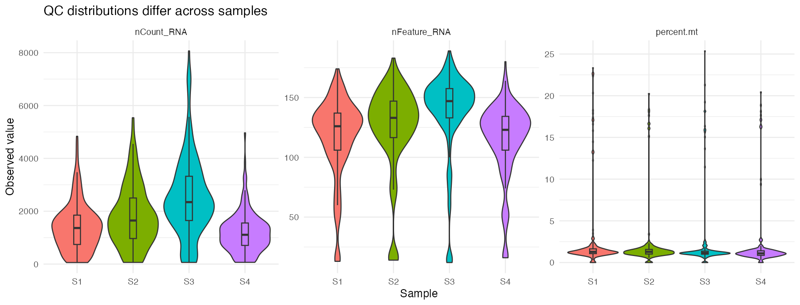
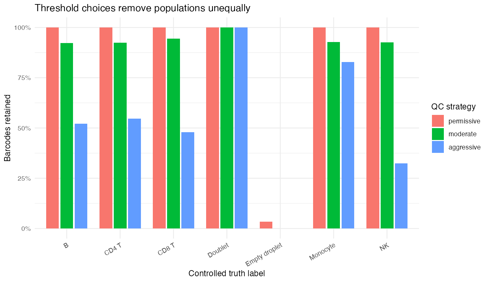
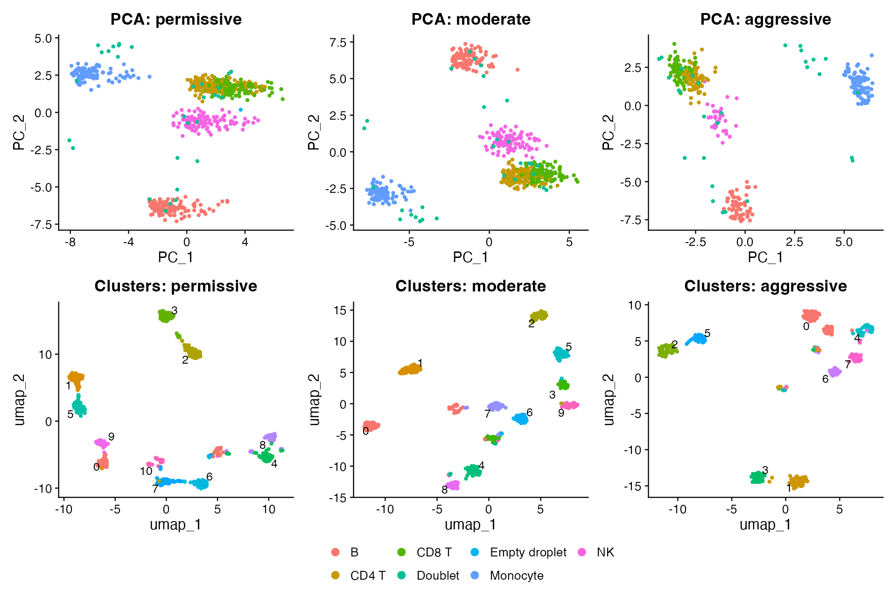

## Learning objectives

By the end of this module, you should be able to:

1. derive and interpret `nCount_RNA`, `nFeature_RNA`, mitochondrial percentage, ribosomal percentage, and a library-complexity summary;
2. distinguish low-quality/dying profiles, stressed cells, empty droplets, ambient contamination, and doublets conceptually;
3. visualize QC distributions by cell and by sample;
4. explain why universal thresholds are inappropriate;
5. compare permissive, moderate, and aggressive filtering while changing only the QC rules;
6. quantify which controlled populations are preferentially lost; and
7. demonstrate how QC choices alter PCA structure and graph clusters.

**Suggested time:** 75–90 minutes of conceptual work plus 120 minutes of computation.

## QC is a selection model

Quality control decides which barcode profiles will define every downstream representation. It is not merely “cleaning bad cells.” A threshold can remove:

- technical failures;
- empty or ambient-dominated droplets;
- doublets;
- damaged or dying cells;
- stressed but viable cells;
- genuine low-RNA cell types; and
- rare transitional states.

The same cutoff can therefore improve one analysis and bias another.

::: {.callout-important title="The central question"}
Do not ask only, “How many cells did this rule remove?” Ask, “Which barcodes were removed, from which samples and populations, and how did their removal change the biological conclusion?”
:::

## Load the controlled dataset

The bundled data contain known QC classes so that threshold consequences can be measured directly.

```r
library(Seurat)
library(ggplot2)
library(patchwork)
library(dplyr)
library(tidyr)

source("scripts/course_helpers.R")

obj <- load_teaching_object()
obj <- add_qc_metrics(obj)

obj
table(obj$truth_qc_class)
table(obj$sample_id)
```

In a real study, `truth_qc_class` and `truth_cell_type` would not be available. They are included here because the goal is to learn what each measurement can and cannot detect.

## Core per-barcode measurements

### `nCount_RNA`: observed library size

For barcode $c$:

$$
nCount_{c} = \sum_g x_{g,c}.
$$

This is the total observed UMI count. A low value can reflect an empty droplet, a damaged cell, low capture efficiency, shallow sequencing, or a genuinely small/low-RNA cell. A high value can reflect a high-RNA cell, strong transcriptional activity, better capture, or a doublet.

### `nFeature_RNA`: detected genes

$$
nFeature_{c} = \sum_g \mathbf{1}(x_{g,c} > 0).
$$

This measures observed complexity. It usually increases with library size, so the two metrics are related rather than independent evidence.

### Mitochondrial percentage

$$
\operatorname{percent.mt}_c
= 100 \times
\frac{\sum_{g \in \mathcal{M}} x_{g,c}}
{\sum_g x_{g,c}},
$$

where $\mathcal{M}$ is the mitochondrial gene set.

```r
obj[["percent.mt"]] <- PercentageFeatureSet(
  obj,
  pattern = "^MT-"
)
```

An elevated mitochondrial fraction can be consistent with membrane damage and loss of cytoplasmic RNA. It can also reflect genuine mitochondrial biology, tissue dissociation, activation, or a low denominator. Gene naming conventions differ across species and references, so the pattern must be checked.

### Ribosomal percentage

```r
obj[["percent.ribo"]] <- PercentageFeatureSet(
  obj,
  pattern = "^RP[SL]"
)
```

Ribosomal expression can dominate low-information libraries, but high ribosomal percentage is not universally low quality. Translation programs differ by lineage, activation state, tissue, and protocol.

### A simple complexity summary

One descriptive summary is:

$$
\operatorname{complexity}_c
= \frac{\log_{10}(nFeature_c)}
{\log_{10}(nCount_c)}.
$$

```r
metadata <- obj[[]]

obj$log10_genes_per_umi <-
  log10(pmax(metadata$nFeature_RNA, 1)) /
  log10(pmax(metadata$nCount_RNA, 2))
```

This is not a universal test statistic. It summarizes how quickly detected features accumulate with observed counts and should be interpreted with library size and sample context.

## Visualize distributions before selecting thresholds

### Violin plots by sample

```r
VlnPlot(
  obj,
  features = c(
    "nCount_RNA",
    "nFeature_RNA",
    "percent.mt",
    "percent.ribo",
    "log10_genes_per_umi"
  ),
  group.by = "sample_id",
  ncol = 3,
  pt.size = 0
)
```

{fig-alt="QC metric distributions shown separately for samples S1 through S4"}

The sample distributions differ by design. Applying one minimum count threshold can remove more cells from a lower-depth sample even when its biological composition is valid.

### Histograms reveal tails and multimodality

```r
qc_metadata <- obj[[]]

count_histogram <- ggplot(
  qc_metadata,
  aes(nCount_RNA, fill = sample_id)
) +
  geom_histogram(bins = 45, alpha = 0.55, position = "identity") +
  scale_x_log10() +
  labs(x = "Observed UMIs (log scale)", y = "Barcodes")

feature_histogram <- ggplot(
  qc_metadata,
  aes(nFeature_RNA, fill = sample_id)
) +
  geom_histogram(bins = 45, alpha = 0.55, position = "identity") +
  labs(x = "Detected genes", y = "Barcodes")

count_histogram + feature_histogram
```

### Scatterplots show joint behavior

```r
count_feature_plot <- ggplot(
  qc_metadata,
  aes(nCount_RNA, nFeature_RNA, color = percent.mt)
) +
  geom_point(alpha = 0.65) +
  scale_x_log10() +
  scale_color_viridis_c() +
  labs(
    x = "Observed UMIs (log scale)",
    y = "Detected genes",
    color = "% mitochondrial"
  )

count_complexity_plot <- ggplot(
  qc_metadata,
  aes(nCount_RNA, log10_genes_per_umi, color = sample_id)
) +
  geom_point(alpha = 0.65) +
  scale_x_log10() +
  labs(
    x = "Observed UMIs (log scale)",
    y = "log10 genes / log10 UMIs"
  )

count_feature_plot + count_complexity_plot
```

Look for combinations, not isolated values. For example, very low counts plus few features plus an ambient-like expression profile is more concerning than a low value on one axis alone.

## Sample and cell-type context

Summarize medians by sample:

```r
qc_metadata |>
  group_by(sample_id) |>
  summarise(
    cells = n(),
    median_counts = median(nCount_RNA),
    median_features = median(nFeature_RNA),
    median_percent_mt = median(percent.mt),
    .groups = "drop"
  )
```

Then compare controlled cell types:

```r
qc_metadata |>
  filter(!truth_cell_type %in% c("Doublet", "Empty droplet")) |>
  group_by(truth_cell_type) |>
  summarise(
    cells = n(),
    median_counts = median(nCount_RNA),
    median_features = median(nFeature_RNA),
    .groups = "drop"
  )
```

The synthetic NK and B profiles have lower RNA content than monocytes. A stringent universal minimum can therefore change cell-type composition even if it removes technically weak profiles overall.

In real data, the relevant context may include tissue, dissociation method, chemistry, sequencing run, disease state, and whether nuclei rather than whole cells were measured.

## Stressed versus dying cells

Stress-response genes such as `FOS`, `JUN`, and heat-shock genes can increase during tissue handling. A stressed profile may still be viable and biologically relevant, or it may represent an ex vivo artifact. High stress is not synonymous with high mitochondrial percentage, and neither is a perfect death label.

```r
stress_genes <- c("FOS", "JUN", "JUNB", "HSPA1A", "HSPA1B", "DNAJB1")
stress_counts <- Matrix::colSums(
  LayerData(obj, layer = "counts")[stress_genes, , drop = FALSE]
)

aggregate(
  stress_counts,
  by = list(qc_class = obj$truth_qc_class),
  FUN = median
)
```

Before removing stressed cells, ask whether the study concerns an in vivo stress program, a processing artifact, or both. If the treatment group was processed differently from the control group, filtering can interact with confounding.

## Ambient RNA and empty droplets

Empty droplets can contain free RNA from the suspension. Ambient contamination can also add transcripts to real-cell droplets.

```r
ambient_genes <- c("LYZ", "HBB", "HBA1", "HBA2", "ALB")
ambient_counts <- Matrix::colSums(
  LayerData(obj, layer = "counts")[ambient_genes, , drop = FALSE]
)

ambient_summary <- data.frame(
  qc_class = obj$truth_qc_class,
  ambient_counts = ambient_counts,
  library_size = obj$nCount_RNA
)

ggplot(
  ambient_summary,
  aes(library_size, ambient_counts, color = qc_class)
) +
  geom_point(alpha = 0.65) +
  scale_x_log10() +
  scale_y_log10() +
  labs(x = "Observed UMIs", y = "Ambient-marker UMIs")
```

Low-level `LYZ` in a T-cell profile may be contamination; strong coordinated `LYZ`, `LST1`, `TYROBP`, and `FCER1G` is more consistent with myeloid identity. Context and multi-gene coherence matter.

## Doublets

Doublets can combine incompatible lineage programs and often have high counts or features. However:

- a high-RNA singlet can resemble a doublet by simple metrics;
- a same-lineage doublet may not show conflicting markers;
- a low-depth doublet may not have extreme counts; and
- doublet rates depend on loading and platform.

Therefore, thresholds and computational doublet detection provide evidence, not certainty.

## Controlled threshold sensitivity analysis

We will compare three explicit strategies. These values are chosen for this synthetic dataset and are **not recommendations for other experiments**.

```r
flags <- qc_strategy_flags(obj)

vapply(flags, sum, integer(1))
```

The helper implements:

| Strategy | Minimum UMIs | Minimum genes | Maximum mitochondrial % |
|---|---:|---:|---:|
| Permissive | 50 | 20 | 35 |
| Moderate | 300 | 80 | 20 |
| Aggressive | 900 | 130 | 10 |

### Quantify retained barcodes

```r
retention <- data.frame(
  cell_id = Cells(obj),
  truth_cell_type = obj$truth_cell_type,
  truth_qc_class = obj$truth_qc_class,
  permissive = flags$permissive,
  moderate = flags$moderate,
  aggressive = flags$aggressive
) |>
  pivot_longer(
    cols = c(permissive, moderate, aggressive),
    names_to = "strategy",
    values_to = "retained"
  )

retention |>
  group_by(strategy) |>
  summarise(
    removed = sum(!retained),
    retained = sum(retained),
    .groups = "drop"
  )
```

### Which biological populations are lost?

```r
retention_by_type <- retention |>
  group_by(strategy, truth_cell_type) |>
  summarise(
    total = n(),
    retained_fraction = mean(retained),
    retained = sum(retained),
    .groups = "drop"
  )

ggplot(
  retention_by_type,
  aes(truth_cell_type, retained_fraction, fill = strategy)
) +
  geom_col(position = "dodge") +
  scale_y_continuous(labels = scales::percent) +
  labs(
    x = "Controlled truth label",
    y = "Fraction retained"
  ) +
  theme(axis.text.x = element_text(angle = 30, hjust = 1))
```

{fig-alt="Cell-type retention differs among permissive, moderate, and aggressive filtering"}

The aggressive strategy removes more low-RNA NK and B profiles than monocytes. It also retains simulated doublets because high counts and many detected genes satisfy its rules. Tightening thresholds is not equivalent to improving classification of every artifact.

### Which QC classes are lost?

```r
retention |>
  group_by(strategy, truth_qc_class) |>
  summarise(
    total = n(),
    retained_fraction = mean(retained),
    retained = sum(retained),
    .groups = "drop"
  )
```

## Downstream consequence: PCA and clusters

To isolate the effect of QC, keep the preprocessing and clustering parameters fixed while changing only the retained barcodes.

```r
filtered_objects <- lapply(
  flags,
  function(keep) {
    run_qc_pipeline(obj, keep)
  }
)
```

The helper normalizes, selects 180 variable genes, scales, runs 20 PCs, constructs neighbors from PCs 1–15, clusters at resolution 0.5, and calculates UMAP with one fixed seed. Those later methods are used here as diagnostic outputs; they are not fully taught in Modules 1–3.

Compare PCA while coloring by the controlled cell label:

```r
pca_plots <- Map(
  function(filtered, strategy) {
    DimPlot(
      filtered,
      reduction = "pca",
      group.by = "truth_cell_type"
    ) +
      ggtitle(paste("PCA:", strategy))
  },
  filtered_objects,
  names(filtered_objects)
)

wrap_plots(pca_plots, ncol = 3, guides = "collect")
```

Compare graph clusters:

```r
cluster_plots <- Map(
  function(filtered, strategy) {
    DimPlot(
      filtered,
      reduction = "umap",
      group.by = "seurat_clusters",
      label = TRUE,
      repel = TRUE
    ) +
      ggtitle(paste("Clusters:", strategy)) +
      NoLegend()
  },
  filtered_objects,
  names(filtered_objects)
)

wrap_plots(cluster_plots, ncol = 3)
```

{fig-alt="Six panels show PCA structure and graph clusters under three QC strategies"}

These panels do not differ by one plotting choice. They differ because filtering changed which cells were used to learn variable genes, scaling parameters, PCs, neighbor graphs, clusters, and UMAP coordinates.

### Quantify downstream differences

```r
downstream_summary <- data.frame(
  strategy = names(filtered_objects),
  retained_cells = vapply(
    filtered_objects,
    ncol,
    integer(1)
  ),
  clusters = vapply(
    filtered_objects,
    function(filtered) length(levels(Idents(filtered))),
    integer(1)
  )
)

downstream_summary
```

Do not declare the strategy with the most clusters “best.” More clusters may reflect retained artifacts, altered graph density, real substructure, or overpartitioning.

## Change one thing: sample-aware thresholds

Calculate sample-specific distributions:

```r
sample_ranges <- qc_metadata |>
  group_by(sample_id) |>
  summarise(
    count_q01 = quantile(nCount_RNA, 0.01),
    count_q50 = quantile(nCount_RNA, 0.50),
    count_q99 = quantile(nCount_RNA, 0.99),
    feature_q01 = quantile(nFeature_RNA, 0.01),
    feature_q50 = quantile(nFeature_RNA, 0.50),
    feature_q99 = quantile(nFeature_RNA, 0.99),
    mt_q99 = quantile(percent.mt, 0.99),
    .groups = "drop"
  )

sample_ranges
```

Use these summaries to propose—not automatically accept—sample-aware rules. Quantiles describe a distribution; they do not identify which tail is biological or technical.

Then answer:

1. Which sample would be most affected by a universal minimum of 900 UMIs?
2. Does that sample appear globally lower depth or selectively lower quality?
3. What evidence beyond these metrics would help distinguish the explanations?
4. Would sample-specific thresholds make cross-sample QC more defensible, or could they hide a failed sample?

## Optional advanced exercise: `scDblFinder`

`scDblFinder` is a Bioconductor method that creates artificial doublets and identifies barcodes whose neighborhoods resemble them. It is optional because it adds Bioconductor dependencies and because no detector is ground truth.

```r
if (
  requireNamespace("SingleCellExperiment", quietly = TRUE) &&
  requireNamespace("scDblFinder", quietly = TRUE)
) {
  library(SingleCellExperiment)
  library(scDblFinder)

  set.seed(20260904)

  sce <- as.SingleCellExperiment(obj)
  sce <- scDblFinder(
    sce,
    samples = "sample_id"
  )

  doublet_comparison <- table(
    predicted = colData(sce)$scDblFinder.class,
    controlled_truth = obj$truth_qc_class == "doublet"
  )

  doublet_comparison
}
```

Evaluate false positives and false negatives. A method can improve prioritization for review without proving that every classification is correct. In real data, expected doublet rate, sample multiplexing, chemistry, cell-type composition, and homotypic doublets all affect interpretation.

## What changed? What did not change? Why?

For the three QC strategies, write a comparison table:

| Question | Permissive vs moderate | Moderate vs aggressive |
|---|---|---|
| What changed in retained cell number? |  |  |
| Which controlled populations changed most? |  |  |
| Which QC classes remained unexpectedly? |  |  |
| What changed in PCA? |  |  |
| What changed in cluster number or composition? |  |  |
| Which biological conclusion changed? |  |  |
| What remained stable? |  |  |

## Common mistakes and interpretation limits

- Applying published cutoffs without examining the current samples.
- Filtering all samples jointly when their distributions or chemistries differ.
- Assuming high mitochondrial percentage always means a dying cell.
- Removing stressed cells without considering whether stress is biological.
- Treating high counts as definitive evidence of a doublet.
- Using only one metric when several jointly describe the profile.
- Reporting only the number of retained cells, not which populations were lost.
- Recomputing an analysis after QC but attributing every visual change directly to one removed cell type.
- Choosing thresholds after looking for the result one hopes to obtain.

## Check your understanding

1. Why are `nCount_RNA` and `nFeature_RNA` correlated?
2. Give two technical and two biological explanations for high mitochondrial percentage.
3. Why might a universal minimum feature threshold preferentially remove NK cells?
4. Can a doublet have an ordinary library size?
5. Why can ambient RNA create a misleading single-marker signal?
6. What evidence distinguishes a sample-wide depth shift from a failed subset of cells?
7. If aggressive QC yields more clearly separated clusters, does that prove it is more accurate?
8. Which parts of the downstream analysis changed after filtering, even though their function parameters stayed fixed?
9. What would you report so another analyst could reproduce and critique your QC decision?

## Lab

Run [the Module 2 student lab](../../labs/02-quality-control-lab.R). Your submission must include the threshold table, population-retention plot, downstream comparison, and a written defense of one strategy. Full credit requires biological reasoning, not only executable code.
