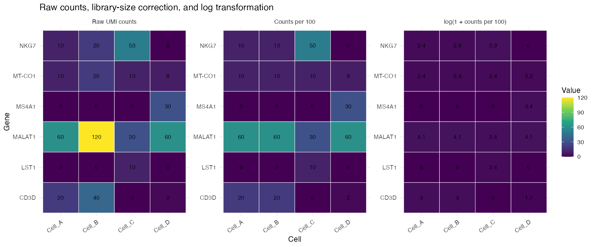
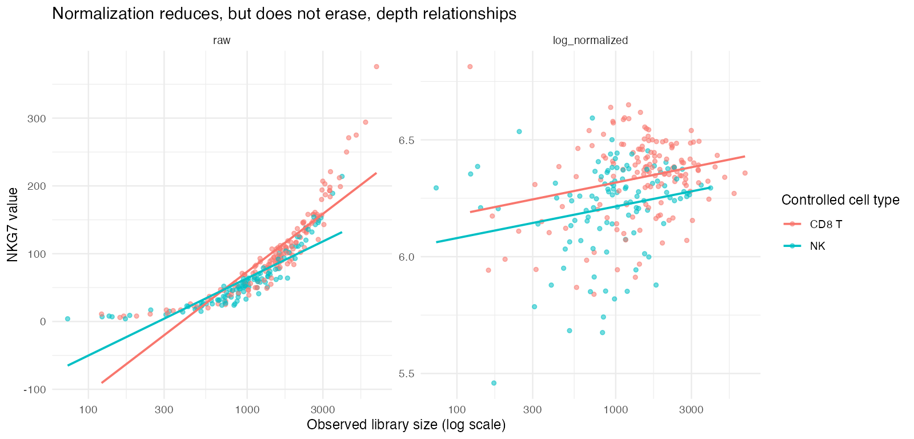

## Learning objectives

By the end of this module, you should be able to:

1. explain why raw UMI counts are not directly comparable across cells with different observed library sizes;
2. calculate library-size-normalized and log-normalized expression manually;
3. reproduce Seurat's `LogNormalize` calculation in base R;
4. distinguish raw counts, counts per scale factor, and log-normalized values;
5. explain what normalization does **not** correct;
6. evaluate how the scale factor and log transform change numerical values;
7. preserve raw counts while storing normalized values in a separate Seurat layer; and
8. compare the goals and caveats of `LogNormalize` and `SCTransform` without treating either as universally superior.

**Suggested time:** 75–90 minutes of conceptual work plus 90–120 minutes of computation.

## The problem: observed library sizes differ

Two otherwise similar cells can contribute different total UMI counts because of capture efficiency, sequencing allocation, cell RNA content, cell size, damage, or other technical and biological factors.

Return to the controlled four-cell matrix:

```r
toy <- read.csv(
  "data/toy_counts.csv",
  row.names = 1,
  check.names = FALSE
)
toy <- as.matrix(toy)

toy
colSums(toy)
```

Cell A has 100 observed UMIs and Cell B has 200. Every gene count in Cell B is twice the corresponding count in Cell A. Their **compositions** are identical, but their raw numerical values differ.

If raw counts are compared directly, every detected gene appears higher in Cell B. The analysis would confuse a library-wide multiplier with gene-specific regulation.

## Seurat `LogNormalize`, step by step

Let:

- $x_{g,c}$ be the raw UMI count for gene $g$ in cell $c$;
- $L_c = \sum_{g'} x_{g',c}$ be the observed library size of cell $c$; and
- $s$ be a chosen scale factor, conventionally 10,000 in Seurat.

First calculate counts per scale factor:

$$
r_{g,c}
= \frac{x_{g,c}}{L_c} \times s.
$$

Then apply the natural logarithm after adding 1:

$$
y_{g,c}
= \log\left(1 + r_{g,c}\right)
= \log\left(
1 + \frac{x_{g,c}}{\sum_{g'} x_{g',c}} \times s
\right).
$$

With Seurat's default $s = 10{,}000$:

$$
\operatorname{LogNormalize}(x_{g,c})
= \log\left(
1 + \frac{x_{g,c}}{\sum_{g'} x_{g',c}} \times 10{,}000
\right).
$$

The dummy index $g'$ in the denominator means “sum across all genes” without reusing the focal gene index $g$.

## Hand calculation

For CD3D in Cell A:

$$
x_{\mathrm{CD3D},A}=20, \qquad L_A=100.
$$

Using $s=100$ so the arithmetic remains transparent:

$$
r_{\mathrm{CD3D},A}
= \frac{20}{100}\times100
=20,
$$

and:

$$
y_{\mathrm{CD3D},A}
=\log(1+20)
\approx3.045.
$$

For CD3D in Cell B:

$$
r_{\mathrm{CD3D},B}
=\frac{40}{200}\times100
=20,
$$

so its log-normalized value is also approximately 3.045. Normalization removes the exact twofold library multiplier in this controlled pair.

### Calculate three entries yourself

Using $s=100$, calculate:

1. NKG7 in Cell A;
2. NKG7 in Cell C; and
3. MS4A1 in Cell D.

For each entry, write the raw count, library size, counts per 100, and $\log(1 + \text{counts per 100})$.

## Reproduce the calculation in R

```r
library(ggplot2)
library(patchwork)
library(dplyr)
library(tidyr)

library_sizes <- colSums(toy)

counts_per_100 <- sweep(
  toy,
  MARGIN = 2,
  STATS = library_sizes,
  FUN = "/"
) * 100

log_normalized <- log1p(counts_per_100)

round(counts_per_100, 3)
round(log_normalized, 3)
```

`log1p(x)` computes $\log(1+x)$ accurately, including for values close to zero.

Confirm the controlled pair:

```r
cbind(
  raw_A = toy[, "Cell_A"],
  raw_B = toy[, "Cell_B"],
  normalized_A = counts_per_100[, "Cell_A"],
  normalized_B = counts_per_100[, "Cell_B"]
)
```

## Side-by-side: raw, relative, and log-normalized

```r
matrix_to_long <- function(matrix, stage) {
  as.data.frame(matrix) |>
    tibble::rownames_to_column("gene") |>
    pivot_longer(
      -gene,
      names_to = "cell",
      values_to = "value"
    ) |>
    mutate(stage = stage)
}

comparison_long <- bind_rows(
  matrix_to_long(toy, "Raw UMI counts"),
  matrix_to_long(counts_per_100, "Counts per 100"),
  matrix_to_long(log_normalized, "log(1 + counts per 100)")
)

ggplot(
  comparison_long,
  aes(cell, gene, fill = value)
) +
  geom_tile(color = "white") +
  geom_text(aes(label = round(value, 1))) +
  facet_wrap(~stage, nrow = 1, scales = "free") +
  scale_fill_viridis_c() +
  labs(x = "Cell", y = "Gene")
```

{fig-alt="Raw, library-size-corrected, and log-normalized expression values shown side by side"}

### What changed?

- Library-size correction makes Cell A and Cell B equal because their compositions are exactly proportional.
- The log transformation compresses large values more strongly than small values.
- Values are no longer integer molecule counts.

### What did not change?

- Zeros remain zero because $\log(1+0)=0$.
- The original raw count matrix should remain intact.
- Cell C still has a larger relative NKG7 signal than Cells A and B.
- Normalization does not establish why a cell had a different library size.

## Why add 1 and take a logarithm?

The logarithm is undefined at zero, so adding 1 retains zeros. More importantly, the log transform compresses the long right tail of relative expression.

For example:

```r
relative_values <- c(0, 1, 10, 100, 1000)

data.frame(
  relative_value = relative_values,
  log_normalized = log1p(relative_values)
)
```

A tenfold increase does not produce an additive tenfold increase after logging. Differences among very large values are compressed, which reduces their numerical dominance in visualization and later calculations.

::: {.callout-warning}
A difference of 1 on the log-normalized scale does not mean one additional transcript or a one-percentage-point change. Always state which scale is being interpreted.
:::

## Reproduce Seurat's result

```r
library(Seurat)

toy_obj <- CreateSeuratObject(
  counts = toy,
  min.cells = 0,
  min.features = 0
)

toy_obj <- NormalizeData(
  toy_obj,
  normalization.method = "LogNormalize",
  scale.factor = 100,
  verbose = FALSE
)

seurat_counts <- LayerData(
  toy_obj,
  assay = "RNA",
  layer = "counts"
)

seurat_normalized <- LayerData(
  toy_obj,
  assay = "RNA",
  layer = "data"
)

stopifnot(all(as.matrix(seurat_counts) == toy))
stopifnot(all.equal(
  as.matrix(seurat_normalized),
  log_normalized,
  tolerance = 1e-10
))
```

In Seurat v5, raw counts remain in the `counts` layer and normalized values are stored in the `data` layer. Preserving this separation is essential for reproducibility and for methods that require integer counts.

## Perturbation exercise: change only the scale factor

Use three scale factors while holding the raw counts and normalization method fixed:

```r
scale_factors <- c(100, 1000, 10000)

normalized_by_scale <- lapply(
  scale_factors,
  function(scale_factor) {
    log1p(
      sweep(toy, 2, colSums(toy), "/") *
        scale_factor
    )
  }
)

names(normalized_by_scale) <- paste0(
  "scale_",
  scale_factors
)

lapply(
  normalized_by_scale,
  function(matrix) round(matrix["CD3D", ], 3)
)
```

Answer:

1. Which numerical values change?
2. Do zeros change?
3. Does Cell C suddenly express CD3D at any scale factor?
4. Does the ranking of cells for a nonzero gene always remain identical after changing the scale factor and applying the log transform?
5. Why should the scale factor be reported even though it is not a biological parameter?

## Apply normalization to the controlled immune dataset

```r
source("scripts/course_helpers.R")

obj <- load_teaching_object()
obj <- add_qc_metrics(obj)

obj_log <- NormalizeData(
  obj,
  normalization.method = "LogNormalize",
  scale.factor = 10000,
  verbose = FALSE
)

raw_nkg7 <- as.numeric(
  LayerData(obj_log, layer = "counts")["NKG7", ]
)

log_nkg7 <- as.numeric(
  LayerData(obj_log, layer = "data")["NKG7", ]
)

depth_comparison <- data.frame(
  nCount_RNA = obj_log$nCount_RNA,
  truth_cell_type = obj_log$truth_cell_type,
  raw_NKG7 = raw_nkg7,
  normalized_NKG7 = log_nkg7
)
```

Compare raw and normalized NKG7 among CD8 T and NK cells:

```r
depth_long <- depth_comparison |>
  filter(truth_cell_type %in% c("CD8 T", "NK")) |>
  pivot_longer(
    cols = c(raw_NKG7, normalized_NKG7),
    names_to = "expression_scale",
    values_to = "NKG7"
  )

ggplot(
  depth_long,
  aes(nCount_RNA, NKG7, color = truth_cell_type)
) +
  geom_point(alpha = 0.55) +
  geom_smooth(method = "lm", se = FALSE) +
  scale_x_log10() +
  facet_wrap(~expression_scale, scales = "free_y") +
  labs(
    x = "Observed library size (log scale)",
    y = "NKG7 value",
    color = "Controlled cell type"
  )
```

{fig-alt="Raw NKG7 counts show a strong depth relationship that is reduced after log normalization"}

Normalization reduces a library-wide depth relationship. It does not force every depth correlation to zero because biological identity, RNA content, composition, sampling variance, and contamination remain.

## What normalization does not correct

`LogNormalize()` does **not** automatically:

- remove batch effects;
- correct donor or sample confounding;
- make cells independent biological replicates;
- remove ambient RNA;
- identify doublets;
- repair low-quality cells;
- impute sampling zeros;
- regress mitochondrial, cell-cycle, or stress programs;
- make expression values comparable across genes in the sense required for PCA scaling; or
- justify condition-level statistical inference.

Normalization addresses a defined measurement problem: unequal observed library sizes. Asking it to solve unrelated design or quality problems leads to overinterpretation.

## Zeros after normalization

Because zero remains zero, log normalization does not distinguish a biological zero from a sampling zero. It also does not create information that was never observed.

```r
zero_check <- data.frame(
  raw_zero = raw_nkg7 == 0,
  normalized_zero = log_nkg7 == 0
)

table(zero_check)
```

An imputation method would be a separate model with separate assumptions. This module does not impute expression.

## Biological consequence

Suppose a stimulated sample has deeper observed libraries than a control sample. Raw counts may make many genes appear higher in stimulation simply because more UMIs were observed per cell. Library-size normalization can reduce that global multiplier.

However, if stimulation truly increases total RNA per cell, forcing all cells to the same relative library size can obscure an absolute global shift. Standard scRNA-seq usually lacks spike-ins or absolute molecule recovery needed to identify such shifts cleanly. Normalization therefore encodes an assumption: much of the library-size difference is unwanted for the intended comparison.

::: {.callout-important title="State the estimand"}
After library-size normalization, interpretation is primarily relative: how much of a cell's observed library is allocated to a gene, followed by transformation. Do not silently reinterpret the result as absolute transcripts per cell.
:::

## SCTransform: a model-based alternative

`SCTransform()` fits a regularized negative-binomial model of UMI counts as a function of sequencing depth and produces a variance-stabilized representation. Its Pearson residuals emphasize deviations from the model rather than applying the same explicit divide-scale-log calculation to every gene.

Potential advantages include:

- modeling the mean–variance relationship directly;
- reducing depth-associated variance in a gene-aware manner; and
- combining normalization and variance stabilization in one framework.

Caveats include:

- a more complex model and less transparent hand interpretation;
- dependence on model assumptions and implementation choices;
- values that are not log-normalized counts;
- additional computation and dependencies; and
- the possibility that depth is associated with real biology rather than only nuisance variation.

SCTransform is not automatically superior. The choice depends on the data, analytical goal, compatibility with downstream methods, and whether the model's assumptions are appropriate.

The optional `glmGamPoi` package can accelerate the `vst.flavor = "v2"`
example below. If it is absent, `SCTransform()` falls back to its built-in
fitting implementation; the calculation remains valid but is slower.

## Optional advanced comparison: `LogNormalize` versus `SCTransform`

Run both methods on the same unfiltered controlled object:

```r
obj_log <- NormalizeData(
  obj,
  normalization.method = "LogNormalize",
  scale.factor = 10000,
  verbose = FALSE
)

obj_sct <- SCTransform(
  obj,
  assay = "RNA",
  new.assay.name = "SCT",
  vst.flavor = "v2",
  return.only.var.genes = FALSE,
  verbose = FALSE
)
```

Extract values for one gene. These values are on different scales and should not be compared as if their numerical magnitudes had the same meaning:

```r
log_value <- as.numeric(
  LayerData(
    obj_log,
    assay = "RNA",
    layer = "data"
  )["GZMK", ]
)

sct_residual <- as.numeric(
  LayerData(
    obj_sct,
    assay = "SCT",
    layer = "scale.data"
  )["GZMK", ]
)

method_comparison <- data.frame(
  nCount_RNA = obj$nCount_RNA,
  truth_cell_type = obj$truth_cell_type,
  LogNormalize = log_value,
  SCTransform_residual = sct_residual
) |>
  filter(truth_cell_type %in% c("CD8 T", "NK")) |>
  pivot_longer(
    cols = c(LogNormalize, SCTransform_residual),
    names_to = "method",
    values_to = "GZMK_value"
  )

ggplot(
  method_comparison,
  aes(nCount_RNA, GZMK_value, color = truth_cell_type)
) +
  geom_point(alpha = 0.55) +
  scale_x_log10() +
  facet_wrap(~method, scales = "free_y") +
  labs(
    x = "Observed library size",
    y = "Method-specific GZMK value"
  )
```

Then compare:

1. the residual association with observed library size;
2. separation of the controlled CD8 T and NK groups;
3. the number and identity of variable genes selected by each workflow;
4. sensitivity to retaining low-quality and empty-droplet profiles; and
5. whether a substantive biological conclusion changes.

Do not choose the method whose plot looks most separated without evaluating why.

## Common mistakes and limitations

- Overwriting raw counts with normalized values.
- Calling log-normalized values “counts.”
- Forgetting which scale factor was used.
- Assuming normalization removes batch effects or QC problems.
- Comparing values from `LogNormalize` and SCTransform as if they share units.
- Treating a zero after normalization as proof of no biological expression.
- Interpreting lower depth correlation as proof that every technical effect is gone.
- Normalizing before deciding whether empty droplets and clear failures should be retained.
- Treating default parameters as biological truths.
- Selecting a normalization method only because it produces preferred clusters.

## Check your understanding

1. Why do Cell A and Cell B have equal normalized CD3D despite different raw counts?
2. What does the scale factor control, and what biological property does it not represent?
3. Why is `log1p()` used instead of `log()`?
4. Does normalization turn a UMI count into an absolute transcript estimate?
5. Name four problems that `NormalizeData()` does not solve.
6. Which Seurat layer should retain integer raw counts?
7. Why can normalized expression still correlate with library size?
8. How does a Pearson residual from SCTransform differ conceptually from a log-normalized value?
9. When could library-size normalization remove a biologically meaningful global RNA difference?
10. What evidence would justify choosing SCTransform over LogNormalize for a specific analysis?

## Lab

Run [the Module 3 student lab](../../labs/03-normalization-lab.R). Submit the hand calculations, the three-stage heatmap, the scale-factor perturbation, the larger-dataset depth comparison, and a written evaluation of the optional SCTransform comparison if completed.
