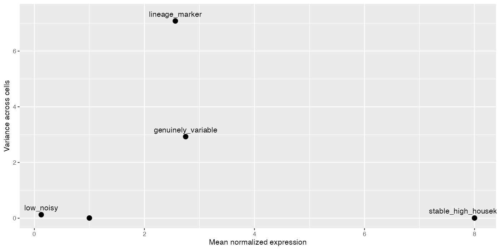
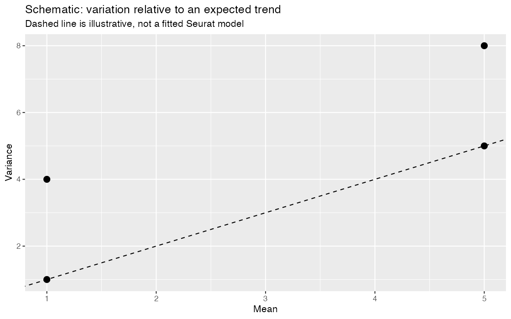
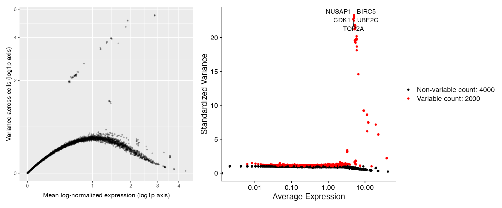
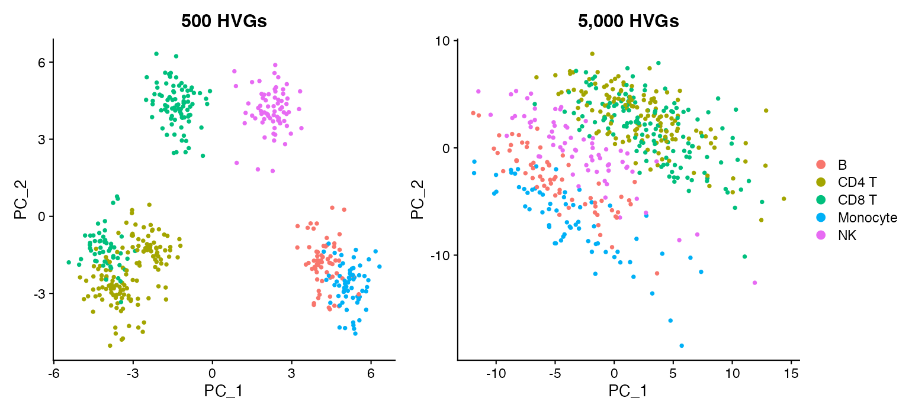

## Learning objectives

By the end of this module, you should be able to:

1. calculate a gene's mean and variance across cells;
2. explain why expression variance generally depends on mean expression;
3. define a highly variable gene (HVG) as a gene that varies more than genes with similar mean expression;
4. distinguish statistical variability from biological importance;
5. use Seurat's `FindVariableFeatures()` and inspect the selected set;
6. compare 500, 1,000, 2,000, 3,000, and 5,000 HVGs using overlap and Jaccard similarity;
7. trace how changing only the number of HVGs changes a downstream PCA; and
8. explain why absence from the HVG set is not evidence that a gene is unexpressed or irrelevant.

**Suggested time:** 80–95 minutes of conceptual work plus 110–130 minutes of computation.

## The problem: not every measured gene is equally informative

After quality control and normalization, an expression matrix can still contain thousands of genes. Some are nearly constant, some are detected too rarely to define a stable pattern, and some differ coherently among lineages or states. Passing every gene into representation learning can add computation and allow abundant but uninformative patterns to dilute useful structure.

Feature selection asks:

> Which genes contain reproducible cell-to-cell variation relative to other genes with similar average expression?

It does **not** ask which genes are important in every biological sense. A stable housekeeping gene can be essential to cell survival and still contribute little to separating cells in this dataset.

::: {.callout-important title="HVG is a dataset-specific statistical label"}
A gene can be an HVG in one tissue, condition, or subset and not in another. “Highly variable” does not mean “most important,” “differentially expressed,” “a marker,” or “causal.”
:::

## Mean and variance across cells

For normalized expression $x_{g,c}$ of gene $g$ in cell $c$, with $C$ cells, the gene mean is

$$
\bar{x}_g = \frac{1}{C}\sum_{c=1}^{C}x_{g,c}.
$$

The sample variance is

$$
s_g^2 = \frac{1}{C-1}\sum_{c=1}^{C}(x_{g,c}-\bar{x}_g)^2.
$$

The mean describes the center of the gene's observed values. The variance describes their spread around that center. Variance is zero only when every included cell has exactly the same value.

## Controlled example: five expression patterns

This small matrix contains normalized-expression values, not UMI counts. Each row represents a distinct pattern.

```r
toy_hvg <- rbind(
  stable_high_housekeeping = c(8.0, 8.1, 7.9, 8.0, 8.1, 7.9, 8.0, 8.0),
  lineage_marker = c(0.0, 0.1, 0.0, 0.2, 5.0, 5.2, 4.9, 5.1),
  low_noisy = c(0, 0, 0, 1, 0, 0, 0, 0),
  genuinely_variable = c(0.5, 1.0, 1.5, 2.0, 3.5, 4.0, 4.5, 5.0),
  important_but_stable = c(1.0, 1.0, 1.1, 0.9, 1.0, 1.0, 0.9, 1.1)
)
colnames(toy_hvg) <- paste0("Cell_", 1:8)

toy_hvg
```

Before calculating anything, predict which rows should help distinguish the first four cells from the last four.

### Calculate the summaries manually

```r
toy_feature_summary <- data.frame(
  gene_pattern = rownames(toy_hvg),
  mean = rowMeans(toy_hvg),
  variance = apply(toy_hvg, 1, var),
  row.names = NULL
)

toy_feature_summary
```

Reproduce one row without `rowMeans()` or `var()`:

```r
x <- toy_hvg["lineage_marker", ]
manual_mean <- sum(x) / length(x)
manual_variance <- sum((x - manual_mean)^2) / (length(x) - 1)

c(mean = manual_mean, variance = manual_variance)
```

### Visualize mean and variance

```r
library(ggplot2)

ggplot(toy_feature_summary, aes(mean, variance, label = gene_pattern)) +
  geom_point(size = 3) +
  geom_text(nudge_y = 0.25, check_overlap = TRUE) +
  labs(x = "Mean normalized expression", y = "Variance across cells")
```

{fig-alt="Mean versus variance for five controlled gene-expression patterns"}

Interpret each row:

- `stable_high_housekeeping` has high expression but almost no cell-separating variation.
- `lineage_marker` varies coherently between two cell groups.
- `low_noisy` varies because of one small isolated observation; its variance is difficult to estimate reliably.
- `genuinely_variable` spans a broad, ordered range.
- `important_but_stable` may be biologically essential yet adds little information about differences among these cells.

## Why raw variance is not enough

For count-derived expression data, genes with larger means often have larger variances simply because more signal can be observed. Comparing the raw variance of a highly expressed gene with that of a barely detected gene is therefore not an even contest.

An HVG procedure models or standardizes the expected mean–variance relationship, then identifies genes that vary more than expected for their mean. In conceptual form:

$$
\text{standardized variability}_g
=
\frac{\text{observed variability}_g-
\text{expected variability at }\bar{x}_g}
{\text{variability scale at }\bar{x}_g}.
$$

This expression explains the comparison; it is not a line-by-line reproduction of Seurat's implementation. Seurat's `vst` method estimates an expected variance trend from the data, standardizes values relative to that trend, and ranks genes by standardized variance.

{fig-alt="Four illustrative genes compared with a dashed expected mean–variance trend"}

For the RNA `vst` workflow, Seurat uses the count layer; the log-normalized scatter above is an exploratory illustration, not the exact data used to fit that trend. Its method standardizes using expected variance and clips extreme values before ranking. See the [FindVariableFeatures reference](https://satijalab.org/seurat/reference/findvariablefeatures).

## Load the representation-learning dataset

The controlled dataset for Modules 4–7 contains 6,000 genes and 480 high-quality immune cells. Its larger gene dimension supports the requested feature-count perturbations without changing the smaller QC dataset used in Modules 1–3.

```r
library(Seurat)
library(Matrix)
library(dplyr)
library(tidyr)
library(patchwork)

source("scripts/course_helpers.R")

obj <- load_representation_object()
obj <- NormalizeData(obj, normalization.method = "LogNormalize", verbose = FALSE)

obj
table(obj$truth_cell_type)
```

These labels are simulation truth for teaching. Real data would require biological annotation and independent evidence.

## Inspect the empirical mean–variance relationship

Calculate summaries from the log-normalized `data` layer:

```r
normalized <- as.matrix(LayerData(obj, assay = "RNA", layer = "data"))

gene_summary <- data.frame(
  gene = rownames(normalized),
  mean = rowMeans(normalized),
  variance = apply(normalized, 1, var),
  row.names = NULL
)

ggplot(gene_summary, aes(mean, variance)) +
  geom_point(alpha = 0.25, size = 0.7) +
  scale_x_continuous(trans = "log1p") +
  scale_y_continuous(trans = "log1p") +
  labs(
    x = "Mean log-normalized expression (log1p axis)",
    y = "Variance across cells (log1p axis)"
  )
```

Genes do not occupy a horizontal band. Expected variability changes with mean, which is why ranking raw variance alone is inadequate.

## Select HVGs with Seurat

```r
obj_2000 <- FindVariableFeatures(
  obj,
  selection.method = "vst",
  nfeatures = 2000,
  verbose = FALSE
)

hvg_2000 <- VariableFeatures(obj_2000)
length(hvg_2000)
head(hvg_2000, 20)

VariableFeaturePlot(obj_2000)
```

`VariableFeatures()` returns an ordered character vector. The first entry is ranked most highly by the chosen method; it is not guaranteed to have the largest mean, the largest raw variance, or the strongest biological relevance.

Label several known programs without treating them as validation truth:

```r
markers_to_label <- c("CD3D", "MS4A1", "NKG7", "LST1")
LabelPoints(
  plot = VariableFeaturePlot(obj_2000),
  points = markers_to_label,
  repel = TRUE
)
```

{fig-alt="Gene mean–variance scatter beside Seurat variable-feature plot"}

## Are familiar markers necessarily HVGs?

```r
marker_hvg_status <- data.frame(
  gene = c("CD3D", "MS4A1", "NKG7", "LST1"),
  selected_at_2000 = c("CD3D", "MS4A1", "NKG7", "LST1") %in% hvg_2000,
  rank = match(c("CD3D", "MS4A1", "NKG7", "LST1"), hvg_2000)
)

marker_hvg_status
```

For each marker, ask:

1. In which cells is it expected to vary?
2. Is it measured often enough for its variability to be stable?
3. Are there many other genes with stronger standardized variability?
4. If it is absent from the selected set, does that change what the counts say about its expression?

The last answer is no: feature selection controls which genes enter a later representation. It does not delete raw or normalized expression and does not determine whether a marker may be visualized or tested appropriately later.

## Change one thing: number of selected features

Hold cells, normalization, selection method, and seed fixed. Change only `nfeatures`.

```r
hvg_counts <- c(500, 1000, 2000, 3000, 5000)

hvg_objects <- lapply(hvg_counts, function(n) {
  FindVariableFeatures(
    obj,
    selection.method = "vst",
    nfeatures = n,
    verbose = FALSE
  )
})
names(hvg_objects) <- paste0("hvg_", hvg_counts)

hvg_sets <- lapply(hvg_objects, VariableFeatures)
vapply(hvg_sets, length, integer(1))
```

### Quantify overlap

```r
pair_grid <- expand.grid(
  set_1 = names(hvg_sets),
  set_2 = names(hvg_sets),
  stringsAsFactors = FALSE
)

pair_grid$jaccard <- mapply(
  function(a, b) jaccard_similarity(hvg_sets[[a]], hvg_sets[[b]]),
  pair_grid$set_1,
  pair_grid$set_2
)

ggplot(pair_grid, aes(set_1, set_2, fill = jaccard)) +
  geom_tile(color = "white") +
  geom_text(aes(label = sprintf("%.2f", jaccard))) +
  scale_fill_viridis_c(limits = c(0, 1)) +
  labs(x = NULL, y = NULL, fill = "Jaccard") +
  theme(axis.text.x = element_text(angle = 35, hjust = 1))
```

For sets $A$ and $B$, Jaccard similarity is

$$
J(A,B)=\frac{|A\cap B|}{|A\cup B|}.
$$

Because these sets come from one ranking, the smaller set will usually be nested within the larger set. In that special case, the Jaccard value is largely determined by set sizes. The exercise is still valuable because it makes the magnitude of the change explicit; in analyses where cells or methods also change, nesting is not guaranteed.

## Carry the perturbation into PCA

Compare the deliberately restrictive 500-HVG representation with the broad 5,000-HVG representation. Keep all other choices fixed.

```r
run_hvg_pca <- function(feature_object, seed = 20260907) {
  feature_object <- ScaleData(
    feature_object,
    features = VariableFeatures(feature_object),
    verbose = FALSE
  )
  RunPCA(
    feature_object,
    features = VariableFeatures(feature_object),
    npcs = 20,
    seed.use = seed,
    verbose = FALSE
  )
}

pca_500 <- run_hvg_pca(hvg_objects$hvg_500)
pca_5000 <- run_hvg_pca(hvg_objects$hvg_5000)

plot_500 <- DimPlot(
  pca_500,
  reduction = "pca",
  group.by = "truth_cell_type",
  raster = FALSE
) + ggtitle("500 HVGs")

plot_5000 <- DimPlot(
  pca_5000,
  reduction = "pca",
  group.by = "truth_cell_type",
  raster = FALSE
) + ggtitle("5,000 HVGs")

plot_500 + plot_5000 + plot_layout(guides = "collect")
```

{fig-alt="Side-by-side PCA plots using 500 and 5000 highly variable genes"}

Inspect numerical consequences rather than judging only visual separation:

```r
comparison <- data.frame(
  cell_id = Cells(pca_500),
  PC1_500 = Embeddings(pca_500, "pca")[, "PC_1"],
  PC1_5000 = Embeddings(pca_5000, "pca")[, "PC_1"],
  PC2_500 = Embeddings(pca_500, "pca")[, "PC_2"],
  PC2_5000 = Embeddings(pca_5000, "pca")[, "PC_2"]
)

cor(comparison$PC1_500, comparison$PC1_5000)
cor(comparison$PC2_500, comparison$PC2_5000)

head(rank_pca_loadings(pca_500, pcs = 1:3, n = 5))
head(rank_pca_loadings(pca_5000, pcs = 1:3, n = 5))
```

The sign of a PC is arbitrary, so a correlation near $-1$ can indicate the same axis with reversed orientation. Compare gene programs and relative cell positions, not signs alone.

## What changed? What did not change? Why?

Complete the table before choosing an HVG count:

| Question | 500 HVGs | 5,000 HVGs |
|---|---|---|
| Which genes entered PCA? |  |  |
| Which familiar markers were selected? |  |  |
| Which broad cell relationships persisted? |  |  |
| Which PC loadings changed? |  |  |
| Which cell coordinates changed? |  |  |
| Did raw or normalized expression change? |  |  |
| Did biological identity change? |  |  |

What changed is the set of variables available to PCA. What did not change is the observed count matrix, normalization, included cells, truth labels, or biology that generated the data. Any changed representation follows from exposing PCA to a narrower or broader collection of variation.

## Biological consequence

Suppose a rare T-cell state is represented by a modest coordinated program. A very small HVG set may omit parts of that program because stronger lineage differences dominate the ranking. A very large set may retain the program but also introduce many weak or noisy genes. Either choice can alter which axes are learned and which cells become neighbors later.

There is no universally correct HVG count. A defensible choice uses sensitivity analysis, checks relevant programs, and reports whether conclusions are stable.

## Common mistakes and interpretation limits

- Calling HVGs “the genes that matter.”
- Ranking genes by raw variance without accounting for mean expression.
- Assuming highly expressed genes must be highly variable.
- Assuming a gene not selected as an HVG is absent or biologically irrelevant.
- Selecting an HVG count because it produces the preferred picture.
- Changing cells, normalization, and HVG count simultaneously, then attributing all differences to feature count.
- Treating the simulated truth labels as if equivalent labels were known in real data.
- Forgetting that selection is learned from the cells currently included.
- Interpreting a PC sign reversal as a contradictory result.

## Check your understanding

1. Why can a stable, highly expressed housekeeping gene have low feature-selection value?
2. Why is raw variance expected to depend on gene mean?
3. What comparison does the phrase “highly variable” imply?
4. Can an important marker fail to enter a 2,000-HVG set? Give two reasons.
5. What does `VariableFeatures()` return, and what does it not change?
6. Why is the 500-versus-5,000 comparison interpretable only if other preprocessing choices remain fixed?
7. Which evidence would make you worry that 500 features is too restrictive?
8. Which evidence would make you worry that 5,000 features adds mostly noise?
9. Why can two equivalent PCA axes have opposite signs?
10. What would you report about feature selection in a reproducible methods section?

## Additional controlled computations

Run the complete lab first to initialize the objects used here.

```r
source("labs/04-variable-features-lab.R")
# Explicit overlap and newly admitted genes, relative to the preceding cutoff.
overlap_counts <- data.frame(nfeatures = hvg_counts,
  overlap_with_500 = vapply(hvg_sets, function(x) length(intersect(x, hvg_sets[[1]])), integer(1)),
  added_since_previous = c(length(hvg_sets[[1]]), vapply(2:5, function(i)
    length(setdiff(hvg_sets[[i]], hvg_sets[[i - 1]])), integer(1))))
print(overlap_counts)
# Label top-ranked features as well as canonical markers.
top_hvg_plot <- LabelPoints(VariableFeaturePlot(obj_2000), points = head(hvg_2000, 5),
  repel = TRUE, xnudge = 0, ynudge = 0)
# Schematic, not Seurat's fitted curve: compare genes at the same expected mean.
schematic_data <- data.frame(mean = c(1, 1, 5, 5), variance = c(1, 4, 5, 8))
schematic_plot <- ggplot(schematic_data, aes(mean, variance)) +
  geom_abline(slope = 1, intercept = 0, linetype = 2) + geom_point(size = 3) +
  labs(title = "Schematic: variation relative to an expected trend",
    subtitle = "Dashed line is illustrative, not a fitted Seurat model",
    x = "Mean", y = "Variance")
print(schematic_plot)
```

For this comparison, state what changed, what stayed fixed, why, and the biological consequence.

## Lab

Run [the Module 4 student lab](../../labs/04-variable-features-lab.R). Submit the manual mean/variance calculation, empirical mean–variance plot, marker-selection table, Jaccard heatmap, 500-versus-5,000 PCA comparison, and a written recommendation that identifies both a benefit and a risk of the chosen feature count.
