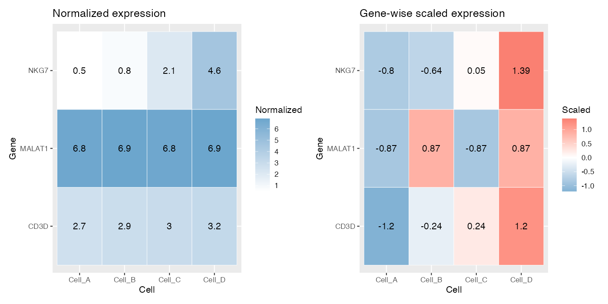
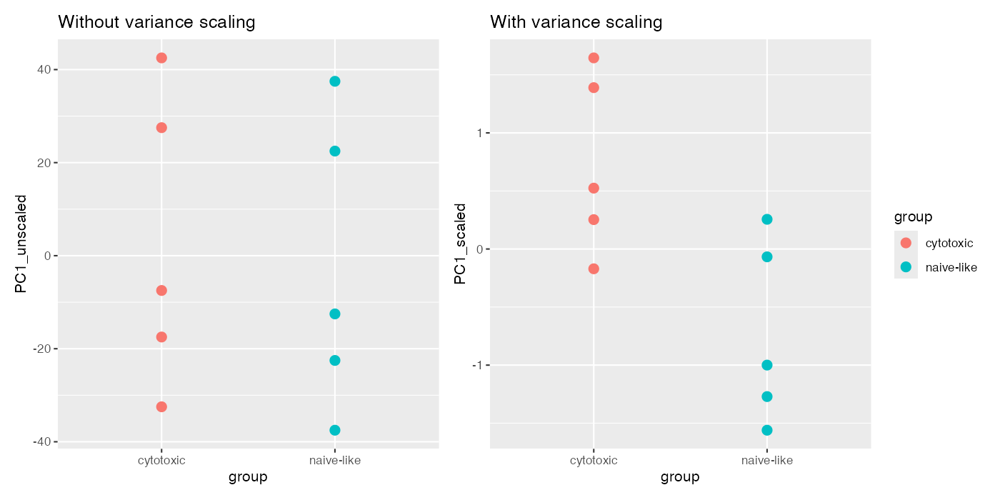
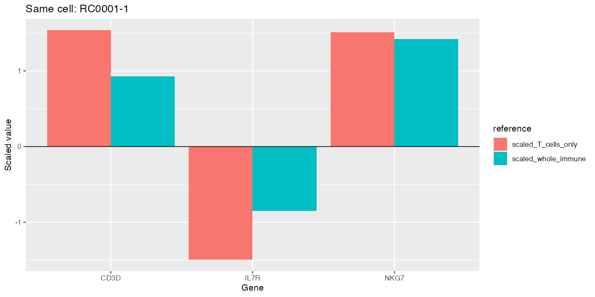
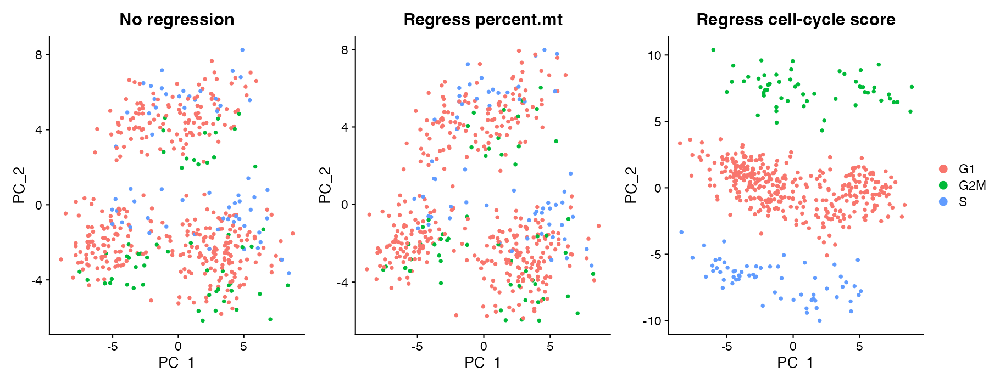
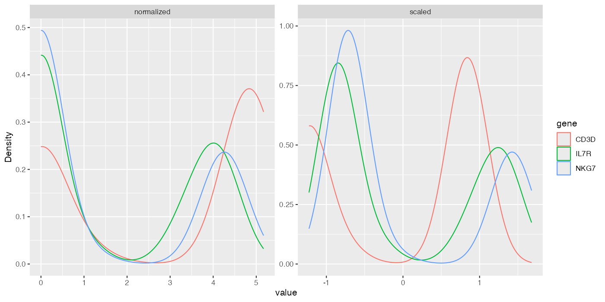
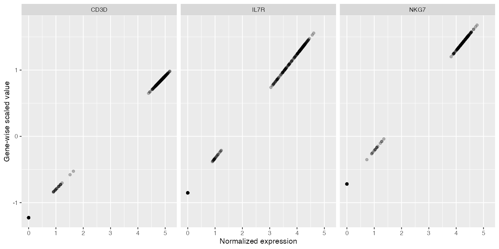
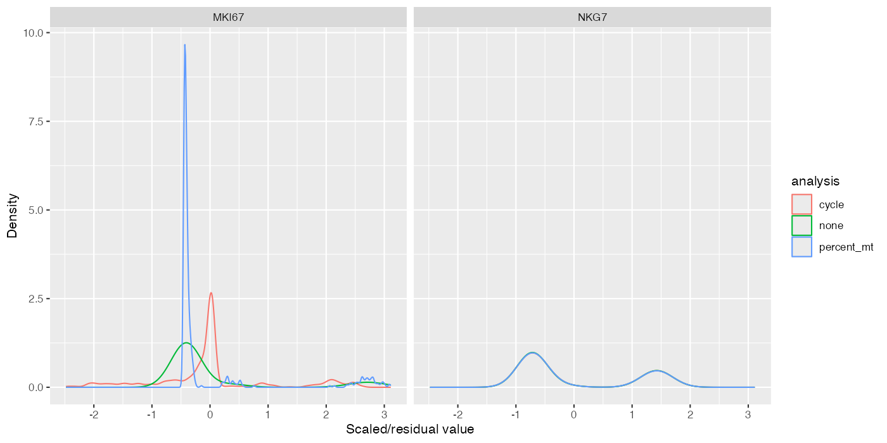

## Learning objectives

By the end of this module, you should be able to:

1. distinguish library-size normalization from gene-wise centering and scaling;
2. calculate a gene-wise z score manually and reproduce it with `scale()`;
3. interpret scaled expression relative to one gene's mean and standard deviation;
4. explain why scaled values from different genes are not fold changes;
5. show why PCA can be dominated by numerically high-variance genes without scaling;
6. demonstrate that scaled values depend on the reference population;
7. describe `ScaleData(vars.to.regress = ...)` as gene-wise regression followed by analysis of residual variation; and
8. compare no regression, mitochondrial-percentage regression, and cell-cycle-score regression without assuming that removable variation should be removed.

**Suggested time:** 90 minutes of conceptual work plus 120–150 minutes of computation.

## From comparable libraries to comparable numerical contributions

Module 3 made gene values more comparable across cells with different observed library sizes. Module 4 selected genes that carry useful variation. A new problem remains: selected genes can have very different numerical ranges and variances.

PCA finds directions that explain variance. If one gene's numerical variance is much larger than another's, it can dominate the result even when the second gene carries a coherent biological distinction. Gene-wise scaling gives each included gene a common reference variance before PCA.

::: {.callout-important title="Normalization and scaling solve different problems"}
`NormalizeData()` adjusts values within each cell for observed library size and transforms them. `ScaleData()` centers each included gene across the chosen cells and usually divides by that gene's standard deviation. Neither operation is batch correction, integration, or biological annotation.
:::

## Mean-centering and standard-deviation scaling

For normalized expression $x_{g,c}$, gene mean $\mu_g$, and gene standard deviation $\sigma_g$, a gene-wise z score is

$$
z_{g,c}=\frac{x_{g,c}-\mu_g}{\sigma_g}.
$$

Mean-centering subtracts $\mu_g$, so the average scaled value for the gene becomes approximately zero. Dividing by $\sigma_g$ expresses each cell's deviation in units of that gene's standard deviation, so the variance becomes approximately one unless values are clipped or additional regression is performed.

Positive means above the reference mean; negative means below it. Neither sign means expressed versus unexpressed.

## Controlled hand calculation

```r
toy_scaled <- rbind(
  NKG7 = c(0.5, 0.8, 2.1, 4.6),
  CD3D = c(2.7, 2.9, 3.0, 3.2),
  MALAT1 = c(6.8, 6.9, 6.8, 6.9)
)
colnames(toy_scaled) <- paste0("Cell_", LETTERS[1:4])

toy_scaled
```

Calculate NKG7 in Cell D:

```r
x <- toy_scaled["NKG7", ]
mu <- mean(x)
sigma <- sd(x)
manual_z <- (x["Cell_D"] - mu) / sigma

c(mean = mu, standard_deviation = sigma, z_Cell_D = manual_z)
```

Then reproduce every entry with base R:

```r
manual_scaled <- t(apply(toy_scaled, 1, function(x) {
  (x - mean(x)) / sd(x)
}))

base_scaled <- t(scale(t(toy_scaled)))

stopifnot(
  identical(dimnames(manual_scaled), dimnames(base_scaled)),
  isTRUE(all.equal(as.vector(manual_scaled), as.vector(base_scaled), tolerance = 1e-12))
)
round(base_scaled, 3)
```

`scale()` operates down columns, so transposing makes genes the variables being scaled and transposing back restores genes as rows.

## Side-by-side: normalized and scaled values

```r
library(ggplot2)
library(dplyr)
library(tidyr)
library(patchwork)

matrix_long <- function(x, stage) {
  as.data.frame(x) |>
    tibble::rownames_to_column("gene") |>
    pivot_longer(-gene, names_to = "cell", values_to = "value") |>
    mutate(stage = stage)
}

scale_long <- bind_rows(
  matrix_long(toy_scaled, "Normalized expression"),
  matrix_long(base_scaled, "Gene-wise scaled expression")
)

normalized_heatmap <- ggplot(subset(scale_long, stage == "Normalized expression"), aes(cell, gene, fill = value)) +
  geom_tile(color = "white") + geom_text(aes(label = round(value, 2))) +
  scale_fill_gradient(low = "white", high = "skyblue3", name = "Normalized") +
  labs(title = "Normalized expression", x = "Cell", y = "Gene")
scaled_heatmap <- ggplot(subset(scale_long, stage == "Gene-wise scaled expression"), aes(cell, gene, fill = value)) +
  geom_tile(color = "white") + geom_text(aes(label = round(value, 2))) +
  scale_fill_gradient2(low = "skyblue3", mid = "white", high = "salmon", midpoint = 0, name = "Scaled") +
  labs(title = "Gene-wise scaled expression", x = "Cell", y = "Gene")
scale_plot <- normalized_heatmap + scaled_heatmap

print(scale_plot)
```

{fig-alt="Side-by-side heatmaps of normalized and gene-wise z-scored expression"}

### Interpret values within genes

A scaled NKG7 value of $+2$ means approximately two NKG7 standard deviations above the NKG7 mean in the reference cells. A scaled CD3D value of $+0.5$ means half a CD3D standard deviation above the CD3D mean.

It is **incorrect** to say that NKG7 is four times as expressed as CD3D. The denominators differ: one value is measured in NKG7 standard deviations and the other in CD3D standard deviations. Scaled values are not counts, proportions, fold changes, or common absolute units across genes.

### What changed?

- Every gene now has a reference mean near zero.
- Genes with different original ranges have comparable variance contributions.
- The numerical value for a cell depends on the other cells used to estimate $\mu_g$ and $\sigma_g$.

### What did not change?

- The raw `counts` layer.
- The normalized `data` layer.
- Which cells and genes were observed.
- The biological sample that generated each cell.

## Why scaling matters for PCA

Build a controlled example with one large-range nuisance measurement and one smaller coherent group signal:

```r
unscaled_example <- data.frame(
  cell = paste0("Cell_", 1:10),
  group = rep(c("naive-like", "cytotoxic"), each = 5),
  large_range_gene = c(20, 80, 35, 95, 45, 25, 85, 40, 100, 50),
  coherent_state_gene = c(1.0, 1.2, 0.8, 1.1, 0.9, 4.8, 5.2, 5.0, 4.9, 5.1)
)

unscaled_pca <- prcomp(
  unscaled_example[, c("large_range_gene", "coherent_state_gene")],
  center = TRUE,
  scale. = FALSE
)

scaled_pca <- prcomp(
  unscaled_example[, c("large_range_gene", "coherent_state_gene")],
  center = TRUE,
  scale. = TRUE
)

unscaled_example$PC1_unscaled <- unscaled_pca$x[, 1]
unscaled_example$PC1_scaled <- scaled_pca$x[, 1]

cor(unscaled_example$PC1_unscaled, unscaled_example$large_range_gene)
cor(unscaled_example$PC1_scaled, unscaled_example$coherent_state_gene)
```

Visualize cell scores:

```r
p_unscaled <- ggplot(
  unscaled_example,
  aes(group, PC1_unscaled, color = group)
) + geom_point(size = 3) + ggtitle("PCA without variance scaling")

p_scaled <- ggplot(
  unscaled_example,
  aes(group, PC1_scaled, color = group)
) + geom_point(size = 3) + ggtitle("PCA after variance scaling")

p_unscaled + p_scaled + plot_layout(guides = "collect")
```

{fig-alt="PC1 scores without and with variance scaling for naive-like and cytotoxic cells"}

Scaling does not prove the smaller-range pattern is biologically correct. It prevents raw numerical magnitude alone from deciding the representation.

## Apply `ScaleData()` to the immune dataset

```r
library(Seurat)
source("scripts/course_helpers.R")

obj <- load_representation_object()
obj <- NormalizeData(obj, verbose = FALSE)
obj <- FindVariableFeatures(
  obj,
  selection.method = "vst",
  nfeatures = 2000,
  verbose = FALSE
)
obj <- ScaleData(obj, features = VariableFeatures(obj), verbose = FALSE)

scaled_matrix <- LayerData(obj, assay = "RNA", layer = "scale.data")
dim(scaled_matrix)
```

By default in this workflow, `scale.data` contains the scaled variable features, not necessarily all 6,000 genes. Make the feature set explicit whenever later code depends on a particular gene.

```r
genes_to_inspect <- intersect(
  c("NKG7", "CD3D", "MS4A1", "LST1"),
  rownames(scaled_matrix)
)

data.frame(
  gene = genes_to_inspect,
  scaled_mean = rowMeans(scaled_matrix[genes_to_inspect, , drop = FALSE]),
  scaled_sd = apply(scaled_matrix[genes_to_inspect, , drop = FALSE], 1, sd)
)
```

## Perturbation: change the reference population

Scaling is learned from the included cells. Compare the same T cell and gene under two references: all immune cells versus T cells only.

```r
reference_obj <- NormalizeData(load_representation_object(), verbose = FALSE)
reference_features <- c("NKG7", "CD3D", "IL7R")

whole_scaled <- ScaleData(
  reference_obj,
  features = reference_features,
  verbose = FALSE
)

t_cells <- Cells(reference_obj)[reference_obj$truth_cell_type %in% c("CD4 T", "CD8 T")]
t_reference <- subset(reference_obj, cells = t_cells)
t_scaled <- ScaleData(
  t_reference,
  features = reference_features,
  verbose = FALSE
)

same_cell <- t_cells[1]

reference_comparison <- data.frame(
  gene = reference_features,
  normalized_value = as.numeric(
    LayerData(reference_obj, layer = "data")[reference_features, same_cell]
  ),
  scaled_whole_immune = as.numeric(
    LayerData(whole_scaled, layer = "scale.data")[reference_features, same_cell]
  ),
  scaled_T_cells_only = as.numeric(
    LayerData(t_scaled, layer = "scale.data")[reference_features, same_cell]
  )
)

reference_comparison
```

{fig-alt="Same-cell scaled expression under whole-immune and T-cell-only reference populations"}

The cell and its normalized values did not change. The reference mean and standard deviation changed. A z score is therefore a contextual location, not an intrinsic molecular property of a cell.

## Regression in `ScaleData()`

Suppose normalized expression of gene $g$ is associated with a metadata variable $q_c$, such as mitochondrial percentage or a cell-cycle score. In simplified form, a gene-wise model is

$$
x_{g,c}=\beta_{0,g}+\beta_{1,g}q_c+\varepsilon_{g,c}.
$$

`ScaleData(vars.to.regress = "q")` fits a model for each gene, uses residual variation $\varepsilon_{g,c}$ after accounting for the specified variable, then centers and scales the result for downstream use.

Plainly: regression asks what remains of each gene's variation after removing the fitted association with the chosen covariate.

::: {.callout-warning title="Regressible does not mean disposable"}
A variable can be modeled and removed computationally even when it carries real biology. Mitochondrial programs can reflect tissue state; cell cycle can be the phenomenon of interest; and either can be confounded with condition or cell type. Automatic regression can erase signal and create misleading residual structure.
:::

## Controlled comparison: no regression versus two regressions

Hold cells, normalization, HVGs, PCA feature set, PC count, and seed fixed. Change only `vars.to.regress`.

```r
base_obj <- load_representation_object()
base_obj <- NormalizeData(base_obj, verbose = FALSE)
base_obj <- FindVariableFeatures(
  base_obj,
  selection.method = "vst",
  nfeatures = 2000,
  verbose = FALSE
)
features <- VariableFeatures(base_obj)

run_scaled_pca <- function(obj, regress = NULL) {
  obj <- ScaleData(
    obj,
    features = features,
    vars.to.regress = regress,
    verbose = FALSE
  )
  RunPCA(
    obj,
    features = features,
    npcs = 30,
    seed.use = 20260907,
    verbose = FALSE
  )
}

no_regression <- run_scaled_pca(base_obj)
regress_mito <- run_scaled_pca(base_obj, "percent.mt")
regress_cycle <- run_scaled_pca(base_obj, "cell_cycle_score")
```

### Compare PCA structure

```r
regression_plots <- list(
  DimPlot(no_regression, reduction = "pca", group.by = "cell_cycle_phase") +
    ggtitle("No regression"),
  DimPlot(regress_mito, reduction = "pca", group.by = "cell_cycle_phase") +
    ggtitle("Regress percent.mt"),
  DimPlot(regress_cycle, reduction = "pca", group.by = "cell_cycle_phase") +
    ggtitle("Regress cell-cycle score")
)

wrap_plots(regression_plots, ncol = 3, guides = "collect")
```

{fig-alt="Three PCA plots under no regression, mitochondrial regression, and cell-cycle regression"}

### Quantify residual associations

```r
pc1_associations <- data.frame(
  analysis = c("none", "percent.mt", "cell_cycle_score"),
  PC1_cor_percent_mt = c(
    cor(Embeddings(no_regression, "pca")[, 1], no_regression$percent.mt),
    cor(Embeddings(regress_mito, "pca")[, 1], regress_mito$percent.mt),
    cor(Embeddings(regress_cycle, "pca")[, 1], regress_cycle$percent.mt)
  ),
  PC1_cor_cell_cycle = c(
    cor(Embeddings(no_regression, "pca")[, 1], no_regression$cell_cycle_score),
    cor(Embeddings(regress_mito, "pca")[, 1], regress_mito$cell_cycle_score),
    cor(Embeddings(regress_cycle, "pca")[, 1], regress_cycle$cell_cycle_score)
  )
)

pc1_associations
```

PC1 is only one axis; repeat across multiple PCs before concluding that a program disappeared.

### Inspect loading programs

```r
loading_comparison <- bind_rows(
  rank_pca_loadings(no_regression, pcs = 1:5, n = 5) |>
    mutate(analysis = "none"),
  rank_pca_loadings(regress_mito, pcs = 1:5, n = 5) |>
    mutate(analysis = "percent.mt"),
  rank_pca_loadings(regress_cycle, pcs = 1:5, n = 5) |>
    mutate(analysis = "cell_cycle_score")
)

loading_comparison
```

Ask whether cell-cycle, mitochondrial, lineage, or state programs move among PCs. Regression can redistribute variance rather than producing one universally cleaner representation.

## When might regression be appropriate?

Regression is more defensible when all of the following are considered:

- the covariate is measured or estimated adequately;
- the analysis goal explicitly treats its associated variation as nuisance;
- the covariate is not inseparable from the biological comparison of interest;
- removing it does not erase a population needed for the scientific question;
- sensitivity analyses show which conclusions change; and
- the choice and model are reported.

For example, cell-cycle regression may be useful when the goal is to compare stable lineage identity and cycling status is a known orthogonal nuisance. It is inappropriate when proliferation is a response of interest or is confounded with condition.

## What changed? What did not change? Why?

| Question | No regression | Regress percent.mt | Regress cell-cycle score |
|---|---|---|---|
| Which scaled values changed? |  |  |  |
| Which PC loading programs changed? |  |  |  |
| Which cell-score relationships changed? |  |  |  |
| Which lineages remained separated? |  |  |  |
| Which biological program may have been attenuated? |  |  |  |
| Did counts or normalized values change? |  |  |  |

## Biological consequence

If activated T cells genuinely proliferate while resting T cells do not, regressing a cell-cycle score can make the representation emphasize non-cycle differences. That may help a lineage-focused question but would hide part of the activation response. Likewise, percent mitochondrial expression can be a technical quality signal, a biological metabolic signal, or both.

The correct question is not “Can I regress this?” It is “Which estimand remains after I regress this, and is that the estimand my study needs?”

## Common mistakes and interpretation limits

- Calling scaled values normalized counts.
- Interpreting z scores as fold changes or absolute expression.
- Comparing a z score for one gene numerically with a z score for another as if they share molecular units.
- Forgetting that scaling depends on the reference cells.
- Running PCA on unscaled features without checking numerical dominance.
- Regressing `percent.mt`, library size, or cell cycle automatically.
- Assuming a weak residual correlation proves that unwanted biology was removed correctly.
- Regressing a covariate confounded with condition or cell type.
- Changing the HVGs and regression target simultaneously in a sensitivity comparison.
- Forgetting that raw and normalized layers should remain unchanged.

## Check your understanding

1. Which dimension does `NormalizeData()` primarily address, and which dimension does `ScaleData()` address?
2. What does a scaled value of $-1.5$ mean for one gene?
3. Why is NKG7 at $+2$ not four times CD3D at $+0.5$?
4. Why can unscaled PCA be dominated by one gene?
5. Why can the same cell have different scaled NKG7 values in whole immune data and a T-cell subset?
6. What remains after gene-wise regression on a covariate?
7. Give one setting where cell-cycle regression supports the estimand and one where it destroys it.
8. Why can mitochondrial percentage carry biological as well as technical variation?
9. Which layers should remain unchanged after `ScaleData()`?
10. What evidence would you show to defend a regression choice?

The bundled `cell_cycle_score` is a simulated covariate, not an inferred `CellCycleScoring()` result. Removing its linear association need not remove S-versus-G2M differences or nonlinear programs. In real data, examine how scores were estimated before choosing a model. See the [ScaleData reference](https://satijalab.org/seurat/reference/scaledata).

{fig-alt="Gene-expression density plots before and after gene-wise scaling"}

{fig-alt="Normalized versus scaled values for NKG7, CD3D, and IL7R"}

{fig-alt="MKI67 and NKG7 distributions after no regression, mitochondrial regression, and cell-cycle-score regression"}

## Additional controlled computations

Run the complete lab first to initialize the objects used here.

```r
source("labs/05-scaling-regression-lab.R")
# Calculate three values manually, preserving sample-SD arithmetic.
manual_three <- (toy_scaled["NKG7", 1:3] - manual_mean) / manual_sd
print(manual_three)
stopifnot(max(abs(manual_three - base_scaled["NKG7", 1:3])) < 1e-12)
# A transparent regression example: fit, predict, subtract, and scale residuals.
regression_toy <- data.frame(q = 0:5, expression = c(1, 3, 4, 7, 8, 10))
fit <- lm(expression ~ q, data = regression_toy)
regression_toy$fitted <- predict(fit)
regression_toy$residual <- regression_toy$expression - regression_toy$fitted
print(regression_toy)
print(scale(regression_toy$residual))
# Compare distributions and value mappings using identical cells and genes.
gene_values <- data.frame(
  gene = rep(reference_features, each = ncol(whole_scaled)),
  normalized = as.vector(t(as.matrix(LayerData(whole_scaled, layer = "data")[reference_features, ]))),
  scaled = as.vector(t(LayerData(whole_scaled, layer = "scale.data")[reference_features, ])))
mapping_plot <- ggplot(gene_values, aes(normalized, scaled)) + geom_point(alpha = 0.25) +
  facet_wrap(~gene) + labs(x = "Normalized expression", y = "Gene-wise scaled value")
distribution_data <- pivot_longer(gene_values, c(normalized, scaled), names_to = "stage", values_to = "value")
distribution_plot <- ggplot(distribution_data, aes(value, color = gene)) +
  geom_density() + facet_wrap(~stage, scales = "free") + labs(y = "Density")
print(mapping_plot)
print(distribution_plot)
# Residual gene distributions across all three preprocessing choices.
regression_distributions <- bind_rows(lapply(
  list(none = no_regression, percent_mt = regress_mito, cycle = regress_cycle),
  function(x) matrix_long(LayerData(x, layer = "scale.data")[c("MKI67", "NKG7"), ], "scaled")),
  .id = "analysis")
regression_distribution_plot <- ggplot(regression_distributions, aes(value, color = analysis)) +
  geom_density() + facet_wrap(~gene) + labs(x = "Scaled/residual value", y = "Density")
print(regression_distribution_plot)
```

For this comparison, state what changed, what stayed fixed, why, and the biological consequence.

## Lab

Run [the Module 5 student lab](../../labs/05-scaling-regression-lab.R). Submit the hand calculation, normalized-versus-scaled comparison, unscaled-versus-scaled PCA, reference-population analysis, regression comparison, loading-program table, and a written decision about whether either regression is appropriate for a stated analysis goal.
