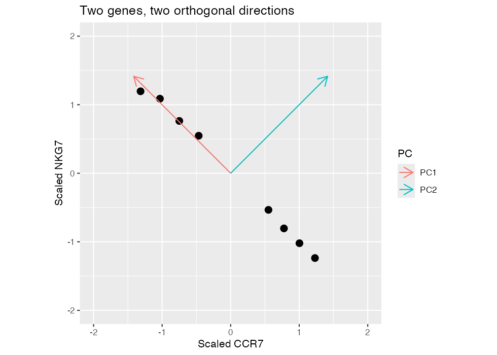
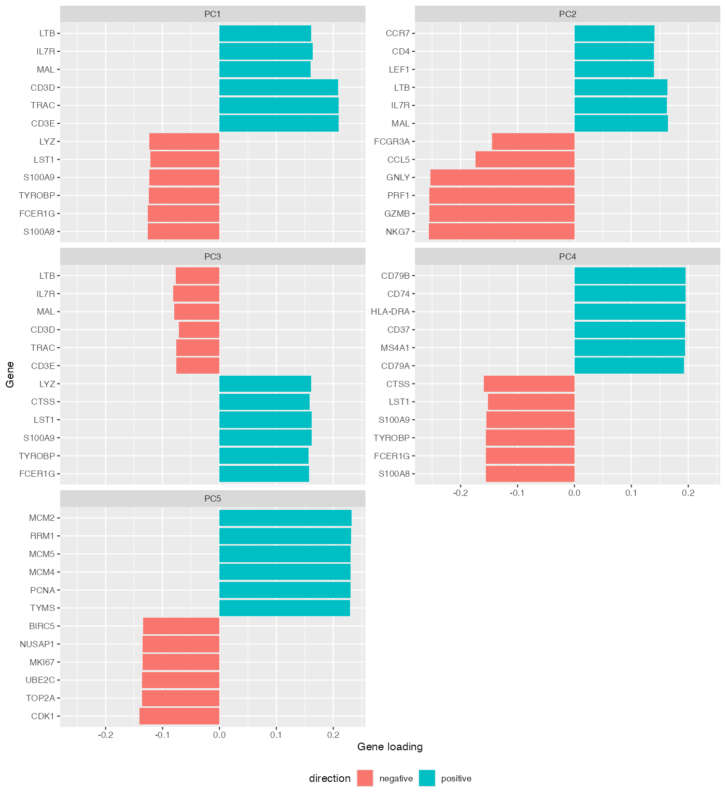
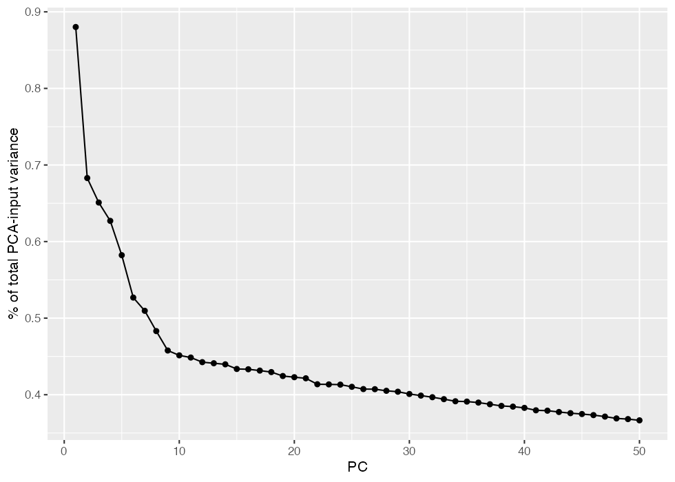
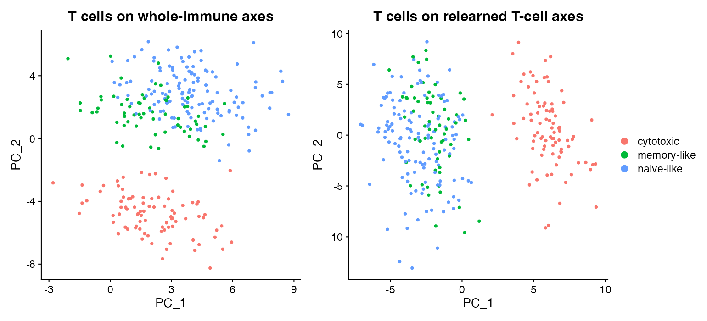

## Learning objectives

By the end of this module, you should be able to:

1. explain dimensionality, correlation, and linear combinations using a small expression matrix;
2. calculate a cell PC score from scaled expression and gene loadings;
3. distinguish the genes-by-PC loading matrix from the cells-by-PC score matrix;
4. explain orthogonality geometrically without equating it with biological independence;
5. rank positive and negative loadings and propose cautious biological interpretations;
6. calculate variance explained with an explicit denominator;
7. compare whole-immune and T-cell-only PCA while recognizing that axes are relearned; and
8. explain why maximum variance does not imply maximum biological importance.

**Suggested time:** two 90-minute concept sessions plus 120–150 minutes of computation.

## The problem: many genes describe overlapping patterns

Module 4 chose informative genes; Module 5 put each gene on a reference scale. We still have thousands of coordinates for each cell. If CCR7, IL7R, and TCF7 rise together, treating them as unrelated directions misses a shared pattern. PCA constructs new coordinates from weighted combinations of the original genes.

A dimension is one numerical coordinate needed to locate an observation. With six input genes, a cell begins as a point in six-dimensional expression space. Six genes do not imply six distinct biological programs: correlated genes can move together. A lower-dimensional representation can retain much of that movement while discarding some smaller variation.

PCA learns a single set of axes from all included cells. It describes relatively global variance in that population. A neighbor graph later asks which cells are close to each particular cell; that local question is different from finding one direction that explains substantial variance across the entire population.

```r
library(Seurat)
library(ggplot2)
library(patchwork)
source("scripts/course_helpers.R")
dir.create("outputs", showWarnings = FALSE)
```

## Controlled example: eight cells and six genes

Start with these deliberately coordinated normalized values. They illustrate arithmetic, not validated T-cell phenotypes. Predict which genes will have similar weights and which will oppose each other before running PCA.

```r
toy_pca <- rbind(
  CCR7 = c(5, 4.6, 4.2, 3.8, 2, 1.5, 1, 0.5),
  IL7R = c(4.8, 4.5, 4, 3.9, 2.1, 1.4, 1.2, 0.4),
  TCF7 = c(4.4, 4.8, 3.8, 4, 1.8, 1.6, 0.8, 0.7),
  NKG7 = c(0.5, 0.9, 1.3, 1.8, 3.8, 4.2, 4.8, 5),
  GNLY = c(0.4, 1.1, 1.2, 1.5, 3.5, 4.5, 4.7, 5.2),
  PRF1 = c(0.8, 0.7, 1.6, 1.4, 4, 4.1, 5.1, 4.8)
)
colnames(toy_pca) <- paste0("Cell_", 1:8)
print(toy_pca)
Z <- t(scale(t(toy_pca)))
print(round(Z, 2))
# prcomp expects cells as rows; genes are columns.
toy_fit <- prcomp(t(Z), center = FALSE, scale. = FALSE)
L <- toy_fit$rotation
S <- toy_fit$x
```

Rows of `toy_pca` are genes. `prcomp()` expects variables in columns, so we transpose the scaled matrix `Z`. We do not scale it a second time. Inspect both the normalized and scaled values: each gene is now measured relative to its own distribution, but correlated ordering remains visible.

### Two genes before six dimensions

Draw scaled CCR7 horizontally and scaled NKG7 vertically. A cell is one point. If their values oppose one another, the point cloud is elongated along a diagonal. PC1 follows the direction of greatest spread; PC2 is perpendicular to it and captures the remaining spread.

{fig-alt="Scaled CCR7 versus scaled NKG7, with PC1 and PC2 arrows and equal axis units"}

The arrows must be judged with equal units on both axes. A stretched plotting window can make perpendicular directions look misleading. Run the geometry section of the lab to recreate this picture. Then change one cell's NKG7 value, rescale, and refit: do the arrows move? Explain why changing one observation can affect the axes assigned to every cell.

## A principal component is a linear combination

A linear combination multiplies each coordinate by a weight and adds the results. Let $z_{g,c}$ be scaled expression, $w_{g,k}$ the loading of gene $g$ on PC $k$, and $s_{c,k}$ the score of cell $c$ on that PC:

$$
s_{c,k}=\sum_{g=1}^{p}z_{g,c}w_{g,k}.
$$

The same weights apply to every included cell. They are learned from the whole input matrix, not chosen independently for each cell. A gene with a large absolute loading helps define that axis strongly, but its contribution to one cell's score also depends on that cell's scaled expression.

For example, an axis with positive NKG7/GNLY/PRF1 weights and negative CCR7/IL7R/TCF7 weights might describe a cytotoxic versus naive/memory-like contrast. This is an interpretation of the observed weights, not a fixed definition of PC3 or any other PC number. The program may occur on another PC or be distributed across several PCs in another population.

| Quantity | Rows | Columns | Question answered |
|---|---|---|---|
| Gene loadings | PCA-input genes | PCs | How does a gene contribute to an axis? |
| Cell scores | Cells | PCs | Where does a cell lie on that axis? |

Every PCA-input gene has a coordinate in every loading vector, although some weights may be zero or tiny. Genes are not assigned to one PC. Genes excluded from the PCA input do not acquire loadings in that fitted PCA merely because their expression remains in the object.

### Calculate one cell's score

```r
print(round(L, 3))
print(round(S, 3))
# A score is a weighted sum over genes, not the loading of one gene.
contributions <- Z[, "Cell_1"] * L[, "PC1"]
print(contributions)
stopifnot(abs(sum(contributions) - S["Cell_1", "PC1"]) < 1e-10)
stopifnot(max(abs(t(Z) %*% L - S)) < 1e-10)
stopifnot(max(abs(crossprod(L) - diag(ncol(L)))) < 1e-10)
stopifnot(max(abs(cov(S) - diag(diag(cov(S))))) < 1e-10)
```

Calculate the first three gene contributions for Cell 1 by hand, then sum all six in R. Repeat for Cell 8. If a gene has a negative loading and below-average expression, what sign is its contribution? Explain how this differs from calling that gene “negatively expressed.”

In matrix notation, let $X$ have cells as rows and scaled genes as columns, $L$ contain loadings, and $S$ contain scores:

$$
S=XL.
$$

Check the dimensions before multiplying. A cells-by-genes matrix times a genes-by-PCs matrix produces a cells-by-PCs matrix. This dimensional check is a practical way to detect a transposition error.

## Orthogonality and its biological limit

Two loading vectors are orthogonal when their dot product is zero:

$$
\sum_g w_{g,1}w_{g,2}=0.
$$

In two dimensions this means perpendicular arrows. In many dimensions the same algebra defines a new direction rather than repeating PC1. For centered PCA data, distinct score columns also have zero sample covariance, apart from numerical approximation.

This constraint does not mean that immune pathways are independent. A biological program can contribute to more than one PC, and correlated pathways can be represented through mixtures on orthogonal mathematical axes. Uncorrelated coordinates also do not establish statistical independence in general.

### Perturbation: reverse the sign, then compress

```r
flipped_L <- L
flipped_S <- S
flipped_L[, 1] <- -L[, 1]
flipped_S[, 1] <- -S[, 1]
stopifnot(max(abs(S %*% t(L) - flipped_S %*% t(flipped_L))) < 1e-10)
# Compare reconstruction with one PC and all PCs.
reconstruction_1 <- S[, 1, drop = FALSE] %*% t(L[, 1, drop = FALSE])
reconstruction_all <- S %*% t(L)
print(c(one_PC_error = sum((t(Z) - reconstruction_1)^2),
        all_PC_error = sum((t(Z) - reconstruction_all)^2)))
```

Compare the one-PC and full reconstruction errors. What did compression discard? What changed when both a loading column and its score column reversed sign? What remained identical about reconstruction and pairwise distances?

A PC's sign is arbitrary: its opposite is an equally valid axis. If two runs differ by a sign, compare programs and relative cell positions before claiming that the biology reversed. If eigenvalues are similar, axes can also rotate or exchange order, so matching PC1 to PC1 is not always sufficient.

## Inspect Seurat's PCA directly

Use the same 6,000-gene, 480-cell controlled dataset as Modules 4 and 5. The preparation function performs normalization, selects 2,000 HVGs, scales them, and runs 50 PCs with a fixed seed. Its source is short and should be inspected alongside the commands.

```r
whole <- prepare_representation_object(nfeatures = 2000, npcs = 50)
pc_loadings <- Loadings(whole, reduction = "pca")
pc_scores <- Embeddings(whole, reduction = "pca")
print(dim(pc_loadings))
print(dim(pc_scores))
print(pc_loadings[1:6, 1:5])
print(pc_scores[1:6, 1:5])
input <- LayerData(whole, layer = "scale.data")[rownames(pc_loadings), , drop = FALSE]
projected <- t(input) %*% pc_loadings
stopifnot(max(abs(projected - pc_scores)) < 1e-4)
```

Under this lab's ordinary `RunPCA()` settings, multiplying the scaled input by the loading matrix reproduces the scores to numerical tolerance. Seurat can drop requested features that were not scaled or have zero variance, so use the returned loading row names to identify the actual input. See the [RunPCA reference](https://satijalab.org/seurat/reference/runpca).

Which returned object contains genes? Which contains cells? Select one row from each and describe it in words before interpreting any plot.

## Interpret both ends of an axis

```r
loading_tables <- do.call(rbind, lapply(1:5, function(k) {
  weights <- pc_loadings[, k]
  positive <- head(sort(weights[weights > 0], decreasing = TRUE), 6)
  negative <- head(sort(weights[weights < 0]), 6)
  data.frame(PC = paste0("PC", k), gene = c(names(positive), names(negative)),
    loading = c(positive, negative), direction = rep(c("positive", "negative"),
      c(length(positive), length(negative))))
}))
print(loading_tables)
write.csv(loading_tables, "outputs/module-06-loadings.csv", row.names = FALSE)
loading_plot <- ggplot(loading_tables, aes(loading, reorder(gene, loading), fill = direction)) +
  geom_col() + facet_wrap(~PC, scales = "free_y", ncol = 2) +
  labs(x = "Gene loading", y = "Gene") + theme(legend.position = "bottom")
print(loading_plot)
ggsave("outputs/module-06-loadings.png", loading_plot, width = 10, height = 11)
```

{fig-alt="Faceted bar charts of six positive and six negative gene loadings for PCs 1 through 5"}

An isolated familiar marker is weak evidence. Look for several coherent genes and inspect both ends. A contrast can reflect myeloid versus lymphoid cells, T versus B cells, naive versus effector states, interferon response, proliferation, or stress. These are possible interpretations, not guaranteed labels for these five PCs.

Complete this table from the unlabeled loading output:

| PC | Positive genes | Negative genes | Proposed interpretation | Confidence and conflicting evidence |
|---|---|---|---|---|
| 1 | | | | |
| 2 | | | | |
| 3 | | | | |
| 4 | | | | |
| 5 | | | | |

A high-loading gene is associated with an axis; it is not thereby causal. Check expression patterns and metadata. A large PC associated with a sample or sequencing covariate may represent technical structure. A smaller PC can still encode a biologically important rare state.

## Variance explained: define the denominator

`Stdev(whole, reduction = "pca")` returns the standard deviation of scores for each retained PC. Squaring gives the variance. Percent of total input variance is

$$
100\frac{\operatorname{Var}(s_{\cdot,k})}{\sum_g\operatorname{Var}(X_{\cdot,g})}.
$$

If only 50 PCs were retained, dividing by their summed variance would instead report a percentage **within those 50**. It would conceal omitted variance. Our helper uses all actual PCA-input genes for the denominator. With unit-variance genes and no clipping, their total variance is approximately the number of genes; the helper measures it rather than assuming it.

```r
variance_whole <- pca_variance_table(whole)
print(head(variance_whole))
stopifnot(sum(variance_whole$percent_variance) <= 100 + 1e-6)
variance_plot <- ggplot(variance_whole, aes(PC, percent_variance)) +
  geom_line() + geom_point() + labs(y = "% of total PCA-input variance")
print(variance_plot)
ggsave("outputs/module-06-variance.png", variance_plot, width = 7, height = 4.5)
```

{fig-alt="Percent total input variance explained by each of 50 retained PCs"}

PCs are ordered by variance, not biological importance. A large lineage contrast or technical effect can dominate PC1. Ask which question the retained variation helps answer rather than expecting the highest-variance axis to be the most interesting one.

## Major comparison: whole population versus T cells only

HVG ranking, gene reference scales, and PCA axes all depend on the included cells. Subsetting the old score matrix alone does not relearn any of them. Here we explicitly reselect features, rescale, and refit PCA within T cells.

```r
t_cells <- Cells(whole)[whole$truth_cell_type %in% c("CD4 T", "CD8 T")]
t_only <- prepare_representation_object(subset(load_representation_object(), cells = t_cells),
  nfeatures = 2000, npcs = 50)
print(c(HVG_overlap = length(intersect(VariableFeatures(whole), VariableFeatures(t_only))),
        HVG_jaccard = jaccard_similarity(VariableFeatures(whole), VariableFeatures(t_only))))
print(rank_pca_loadings(t_only, pcs = 1:5, n = 6))
print(head(pca_variance_table(t_only)))
# A cross-PC correlation table allows axes to move or reverse sign.
score_comparison <- cor(Embeddings(whole, "pca")[t_cells, 1:5],
                        Embeddings(t_only, "pca")[t_cells, 1:5])
print(round(score_comparison, 2))
subset_plot <- DimPlot(subset(whole, cells = t_cells), reduction = "pca", group.by = "truth_t_state", combine = FALSE)[[1]] +
  ggtitle("T cells on whole-immune axes") +
  DimPlot(t_only, reduction = "pca", group.by = "truth_t_state", combine = FALSE)[[1]] +
  ggtitle("T cells on relearned T-cell axes") + plot_layout(guides = "collect")
print(subset_plot)
ggsave("outputs/module-06-subset.png", subset_plot, width = 11, height = 5)
stopifnot(identical(LayerData(whole, layer = "counts")[, t_cells],
                    LayerData(t_only, layer = "counts")))
# Interpret: which axes changed, which programs persisted, and why?
# Does orthogonality imply independent biological pathways? Are PC numbers portable?
```

{fig-alt="Two PCA panels comparing the same T cells using whole-immune and T-cell-only fitted axes"}

The left panel displays only T cells but retains the axes learned from all immune cells. The right learns axes from T cells. This isolates the population used for fitting while showing the same cells. Compare HVG overlap, PC1–PC5 loadings, variance fractions, and the cross-PC correlation matrix. Do not interpret raw score changes as changes in molecules.

Once large non-T lineage differences are absent, within-T variation can account for a larger share of the remaining variance. Cytotoxicity or exhaustion could become prominent in an appropriate dataset; this simulation does not guarantee an exhaustion axis. Biological annotation requires evidence beyond a PC number.

## What changed? What did not change? Why?

| Comparison | What changed? | What stayed fixed? | Why might interpretation change? |
|---|---|---|---|
| Reverse a PC's sign | | | |
| Reconstruct with one versus all toy PCs | | | |
| Whole-immune versus T-cell-only fitting | | | |

## Common mistakes and interpretation limits

- Calling a loading a cell coordinate or a score a gene weight.
- Assigning each gene to only one PC.
- Interpreting negative weights as negative molecule counts.
- Equating orthogonality with independent pathways.
- Comparing PC numbers across fitted populations as if they were fixed biological labels.
- Reporting percentages of retained PCs as percentages of total variance.
- Treating visually separated points as proof of a cell type or causal program.

## Check your understanding

1. What is compressed when six correlated genes become two PC coordinates?
2. Which observations determine the loading weights?
3. How do you calculate one cell score by hand?
4. Can a gene contribute to both PC1 and PC2?
5. Why can a negative loading produce a positive contribution?
6. Why can PC1 contain technical variation?
7. Does orthogonality imply independent biological pathways?
8. How could 50 retained PCs misleadingly be reported as explaining 100%?
9. Why can cytotoxicity move to a different PC after subsetting?
10. What evidence would increase or decrease confidence in a proposed PC interpretation?

## Lab and transition

Run [the complete PCA lab](../../labs/06-pca-lab.R). Submit the hand projection, geometric plot, compression comparison, five-PC interpretation table, and population comparison. Explain every comparison in words. Module 7 now asks which of these learned coordinates should define cell similarity downstream.
