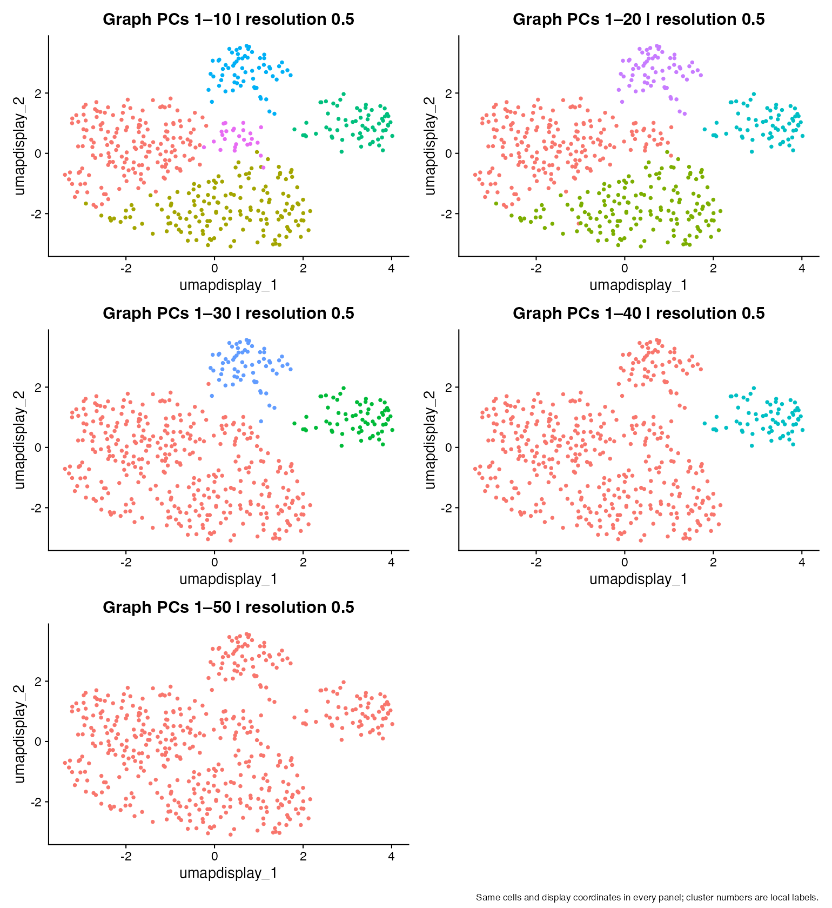
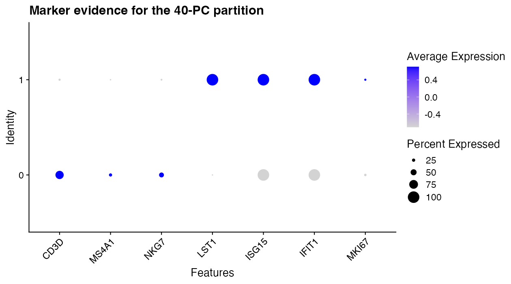

## Learning objectives

By the end of this module, you should be able to:

1. explain that `dims = 1:30` selects 30 PC coordinates, not 30 genes;
2. use an elbow plot while recognizing its limitations;
3. inspect later PC loadings for coherent biological or technical programs;
4. compare 10, 20, 30, 40, and 50 PCs on one fixed PCA object at fixed resolution;
5. measure changes using cluster counts, contingency tables, and composition;
6. distinguish changing the graph from changing its partitioning resolution; and
7. justify a cutoff using statistical and biological evidence, including uncertainty.

**Suggested time:** 75–90 minutes of conceptual work plus 120 minutes of computation.

## What `dims` means

In `FindNeighbors(obj, reduction = "pca", dims = 1:30)`, each cell is compared using its scores on PC1 through PC30. Each coordinate can combine thousands of genes. This does not restrict expression to 30 genes, recompute HVGs, or relearn PCA. It selects coordinates from an already fitted representation.

For ordinary Euclidean distances on scores, the squared distance between cells $a$ and $b$ using $K$ PCs is

$$
d_K(a,b)^2=\sum_{k=1}^{K}(s_{a,k}-s_{b,k})^2.
$$

Adding a coordinate cannot reduce this squared distance, but it can change the relative ordering of distances and therefore which cells are nearest neighbors. Many weak extra coordinates can collectively matter.

## Controlled distance example

```r
coordinates <- rbind(A = c(0, 0, 0), B = c(0.1, 0, 4), C = c(1, 0, 0))
print(as.matrix(dist(coordinates[, 1:2])))
print(as.matrix(dist(coordinates[, 1:3])))
```

Before running the code, calculate A-to-B and A-to-C distances using two coordinates, then three. Which cell is closer to A? Change only B's PC3 score from 4 to 0.2 and repeat. Explain why a distinction invisible in the selected coordinates cannot influence the resulting neighbor graph.

## Elbow plots are evidence, not a cutoff rule

Prepare one object and inspect its 50 retained PCs:

```r
suppressPackageStartupMessages({library(Seurat); library(ggplot2); library(patchwork)})
source("scripts/course_helpers.R")
set.seed(20260907)
dir.create("outputs", showWarnings = FALSE)
obj <- prepare_representation_object(nfeatures = 2000, npcs = 50)
original_scores <- Embeddings(obj, "pca")
original_counts <- LayerData(obj, layer = "counts")
print(ElbowPlot(obj, ndims = 50))
print(rank_pca_loadings(obj, pcs = c(10, 20, 30, 40), n = 6))
```

Seurat's elbow plot displays each PC's score standard deviation. It is not a p-value or automatically a percent-variance plot. An elbow is a region where successive PCs add smaller amounts of variation. There may be several bends or no clear bend.

Too few PCs can omit a coherent state; too many can add weak or noisy variation that changes neighbor rankings. More PCs are neither automatically better nor automatically worse. Dataset size, composition, preprocessing, and the biological question all matter.

### Inspect later PCs before choosing

Use the printed positive and negative loadings for PC10, PC20, PC30, and PC40. Look for several genes in a coherent program and consider whether technical variables explain the same pattern. Record evidence rather than naming a PC from one familiar gene.

| PC | Positive genes | Negative genes | Coherent program? | Technical alternative | Keep for this question? |
|---|---|---|---|---|---|
| 10 | | | | | |
| 20 | | | | | |
| 30 | | | | | |
| 40 | | | | | |

The synthetic dataset may not put an interpretable program in every later PC. A negative result is informative. Do not invent biological meaning because a PC was requested for inspection.

## Central experiment: change PC dimensions, hold resolution fixed

Use the **same** normalized, scaled, 50-PC object for all five comparisons. Keep cells, feature set, neighbor method, and clustering seed fixed. Use resolution 0.5 throughout. The explicit graph names ensure that each partition uses its intended graph, and separate metadata columns preserve every result.

```r
dims_values <- c(10, 20, 30, 40, 50)
fixed_resolution <- 0.5
# Keep this loop explicit: students can see which graph each partition uses.
for (n_dims in dims_values) {
  nn_name <- paste0("nn_dims_", n_dims)
  snn_name <- paste0("snn_dims_", n_dims)
  cluster_name <- paste0("clusters_dims_", n_dims)
  obj <- FindNeighbors(obj, reduction = "pca", dims = seq_len(n_dims),
    graph.name = c(nn_name, snn_name), nn.method = "rann", verbose = FALSE)
  obj <- FindClusters(obj, graph.name = snn_name, resolution = fixed_resolution,
    cluster.name = cluster_name, random.seed = 20260907, verbose = FALSE)
}
```

We use exact nearest-neighbor search here to reduce approximation variability in this small teaching dataset. The subsequent SNN graph summarizes shared neighbors. More detail about graph construction belongs to a later module; the essential point here is that its input coordinates have changed. See the [FindNeighbors reference](https://satijalab.org/seurat/reference/findneighbors).

## Visual comparison on fixed display coordinates

Changing UMAP coordinates and cluster labels together makes differences harder to attribute. For this first experiment, compute one 30-PC UMAP solely as a display and color the same positions by each partition. The clustering comparisons themselves used 10–50 PCs as specified.

```r
obj <- RunUMAP(obj, reduction = "pca", dims = 1:30, seed.use = 20260907,
  reduction.name = "umap_display", verbose = FALSE)
plots <- lapply(dims_values, function(n) {
  DimPlot(obj, reduction = "umap_display", group.by = paste0("clusters_dims_", n)) +
    ggtitle(paste("Graph PCs 1–", n, " | resolution 0.5", sep = "")) + NoLegend()
})
dims_plot <- wrap_plots(plots, ncol = 2) +
  plot_annotation(caption = "Same cells and display coordinates in every panel; cluster numbers are local labels.")
print(dims_plot)
ggsave("outputs/module-07-dims.png", dims_plot, width = 11, height = 12)
stopifnot(identical(original_scores, Embeddings(obj, "pca")),
          identical(original_counts, LayerData(obj, layer = "counts")))
```

{fig-alt="UMAP panels with identical cell coordinates colored by clusters from 10, 20, 30, 40, and 50 PCs at resolution 0.5"}

Cluster IDs and colors are local labels: cluster 2 in one run need not correspond to cluster 2 in another. Compare membership, not color names. UMAP does not define the clusters and its two-dimensional geometry can conceal structure used by a higher-dimensional graph.

If the partition changed, was resolution responsible? State exactly what was held fixed and what changed before interpreting biology.

## Quantify membership changes

```r
cluster_summary <- data.frame(dims = dims_values, resolution = fixed_resolution,
  clusters = vapply(dims_values, function(n) length(unique(obj[[paste0("clusters_dims_", n)]][, 1])), integer(1)))
print(cluster_summary)
write.csv(cluster_summary, "outputs/module-07-cluster-counts.csv", row.names = FALSE)
contingency <- table(PC10 = obj$clusters_dims_10, PC40 = obj$clusters_dims_40)
print(contingency)
print(prop.table(contingency, 1))
for (n in dims_values) {
  print(n)
  print(table(cluster = obj[[paste0("clusters_dims_", n)]][, 1], lineage = obj$truth_cell_type))
}
```

A contingency table counts cells shared by pairs of clusters. A row spread across several columns suggests a split relative to the first partition; several rows concentrated in one column suggest a merge. A change in cluster count alone does not identify which population changed, and an unchanged count does not establish identical membership.

Known simulation labels let us examine composition. They are a teaching aid, not a substitute for annotation in real datasets. Write down which populations remain recognizable, which split, and which mix across all five choices.

### Optional advanced measure: adjusted Rand index

```r
ari <- outer(dims_values, dims_values, Vectorize(function(a, b) {
  adjusted_rand_index(obj[[paste0("clusters_dims_", a)]][, 1],
                      obj[[paste0("clusters_dims_", b)]][, 1])
}))
dimnames(ari) <- list(dims_values, dims_values)
print(round(ari, 3))
stopifnot(max(abs(diag(ari) - 1)) < 1e-10)
```

ARI compares pairs of cell memberships while adjusting for chance agreement. One indicates the same partition up to relabeling; values near zero indicate agreement near its chance baseline, and negative values can occur. It assesses agreement, not biological correctness. Two analyses can agree on an unhelpful partition, and a biologically meaningful refinement can lower agreement.

## Biological interpretation: explain a split with evidence

```r
markers <- c("CD3D", "MS4A1", "NKG7", "LST1", "ISG15", "IFIT1", "MKI67")
Idents(obj) <- "clusters_dims_40"
marker_plot <- DotPlot(obj, features = markers) + RotatedAxis() +
  labs(title = "Marker evidence for the 40-PC partition")
print(marker_plot)
ggsave("outputs/module-07-markers.png", marker_plot, width = 9, height = 5)
```

{fig-alt="Dot plot of lineage, interferon-response, and proliferation genes across the 40-PC clusters"}

For a split identified in the contingency table, inspect multiple marker genes and the later loading tables. If an interferon-responsive population appears only with 40 PCs, identify which included PC carries coherent interferon variation and check whether the same cells express that program. This is a conditional reasoning exercise, not a promised outcome of this simulation.

If new clusters mostly differ in weak, scattered genes, or track an unwanted technical variable, more dimensions may be unhelpful for the stated question. If they reveal a reproducible relevant program, more dimensions may be justified. Neither interpretation follows from a prettier UMAP.

## `dims` versus `resolution`

| Parameter | What it controls | What is held fixed in this module |
|---|---|---|
| `dims` | Which PCA-derived variation defines similarity and therefore the graph | Normalization, HVGs, scaling, PCA, and resolution |
| `resolution` | How the chosen graph is partitioned; often higher values yield finer partitions | Resolution is 0.5 in every comparison |

```text
dims -> input coordinates -> neighbor/SNN graph
resolution + that graph -> partition
```

Changing dimensions can change the graph itself. Changing resolution changes partitioning on a graph. A later exercise could vary resolution while keeping one graph fixed, but changing both at once would confound this first experiment.

## What changed? What did not change? Why?

| Choice | Cluster count | Stable memberships | Splits/merges | Supporting genes | Remaining uncertainty |
|---|---|---|---|---|---|
| PCs 1:10 | | | | | |
| PCs 1:20 | | | | | |
| PCs 1:30 | | | | | |
| PCs 1:40 | | | | | |
| PCs 1:50 | | | | | |

Use the unchanged-score and unchanged-count checks in the lab to establish that the original measurements and PCA did not change. Then explain why memberships can still differ. A computational change in partition is not a biological change in the cells.

## Cross-module synthesis

```text
HVG selection
      ↓
Scaling
      ↓
PCA
      ↓
PC interpretation
      ↓
Choose dims
      ↓
Build neighbor graph
```

Complete this table in your own words:

| Step | Input | Output | Main decision | What could go wrong? |
|---|---|---|---|---|
| HVG selection | | | | |
| Scaling | | | | |
| PCA | | | | |
| dims selection | | | | |

Choose one defensible cutoff and one plausible alternative. Cite the elbow region, loading coherence, membership stability, and biological evidence. Describe what observation would change your decision. There is no universal correct cutoff supplied by this course.

## Common mistakes and interpretation limits

- Reading `dims = 1:30` as 30 genes.
- Rerunning PCA or changing resolution in the middle of a dimensions-only comparison.
- Treating cluster numbers as matched labels across runs.
- Using cluster count or ARI as a measure of biological truth.
- Naming a later PC from one gene.
- Assuming the elbow plot gives an objectively correct cutoff.
- Assuming extra clusters must be new cell types.
- Treating two-dimensional display distances as the complete clustering input.

## Check your understanding

1. Which values enter similarity calculations when `dims = 1:30`?
2. What if relevant information lies on PC25 but only PCs 1:10 are used?
3. Why can a larger pairwise distance still correspond to a closer neighbor ranking?
4. What quantity is on Seurat's elbow-plot y-axis?
5. Why inspect both ends of later loading vectors?
6. If clustering changes here, did resolution change?
7. How can equal cluster counts hide different partitions?
8. What does ARI fail to establish?
9. What distinguishes changing dimensions from changing resolution?
10. Which statistical and biological evidence supports your cutoff?

## Lab

Run [the complete dimensions lab](../../labs/07-choosing-dimensions-lab.R). Submit the controlled distance calculation, later-PC evidence table, five-panel comparison, cluster counts, contingency and composition tables, and cross-module synthesis. Keep ARI optional. Your written recommendation must acknowledge a limitation and a plausible alternative.
